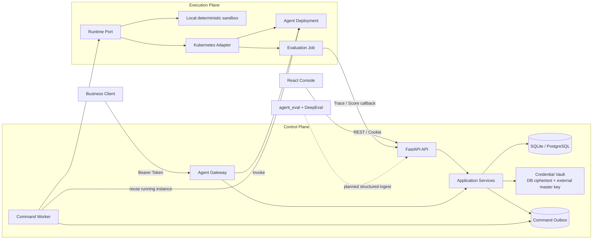
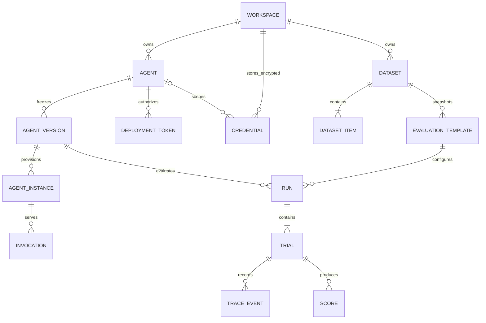
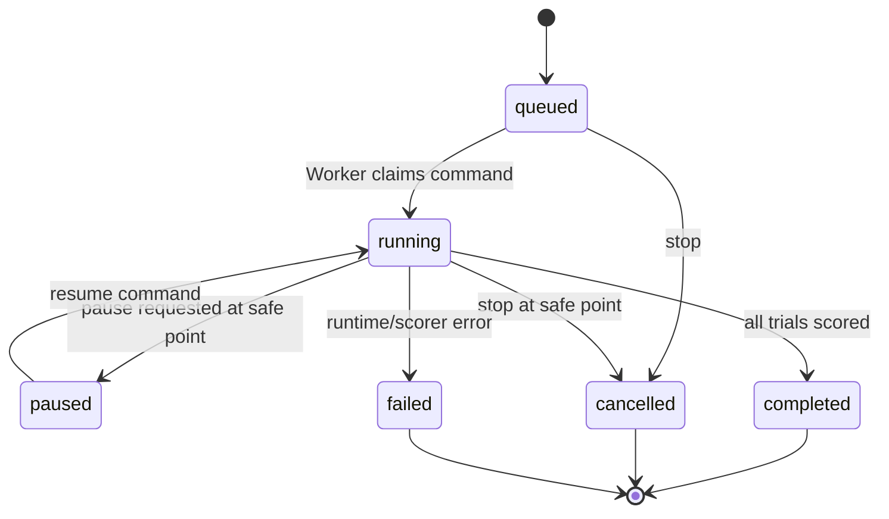

# Eval Loom 后端架构

## 边界

`frontend/` 是控制台，`backend/` 是平台控制面，`src/agent_eval/` 是供被测 Agent 使用的 DeepEval 埋点 SDK。上传的代码包只作为制品进入执行面，控制面进程不会 import 或执行它。

请求线程只完成校验、快照冻结、数据库事务和命令入队。Worker 是控制面与执行面的唯一连接点，因此本地替代组件、Docker、Kubernetes Job 或未来 Argo Workflow 都不会侵入业务用例。

## 领域关系

关键约束：Run 必须绑定不可变 `AgentVersion` 和已发布 `EvaluationTemplate`；Agent 的逻辑启停与实例的运行状态分离；API Key 加密后存入数据库，主密钥不进数据库；删除 Agent 前必须先停止所有实例。

## 部署后的使用链路

`POST /v1/agents/{agent_id}/invoke` 是业务侧稳定入口。平台只保存调用 Token 的 SHA-256 摘要，明文只在创建时返回一次。网关验证 Token 后选择最新的运行实例，再交给当前 Runtime Adapter 调用。控制台 Playground 使用工作区会话调用同一服务，但不需要额外 Token。

当评测开始时，Worker 优先选择该版本已有的运行实例并通过同一 `invoke` 协议执行任务；没有常驻实例时才使用 Runtime 的临时 Trial 执行路径。因此线上调用和离线评测不会各维护一套 Agent 协议。

## 状态机

暂停是协作式安全点，不承诺冻结任意第三方进程；停止会保留已完成 Trial、Trace 和 Score。

## 目录职责

- `api/`：HTTP、认证、工作区权限与 DTO。
- `application/`：业务用例、状态约束、凭证加密；通过 Port 调用外部能力。
- `domain/`：领域状态和不变量。
- `infrastructure/`：SQLite Repository、Local/Kubernetes Runtime Adapter。
- `worker.py`：消费命令并驱动实例与评测，不运行在 Web 请求线程。
