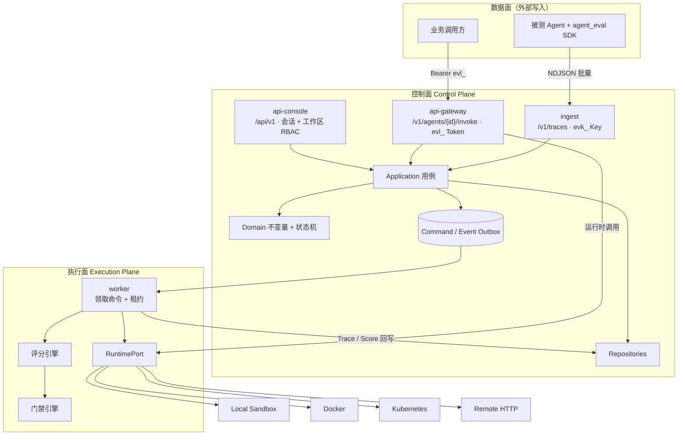
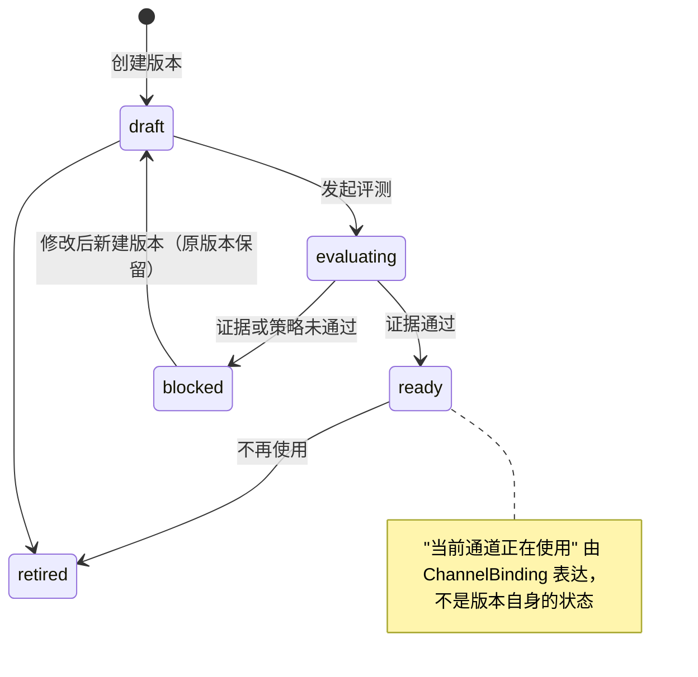
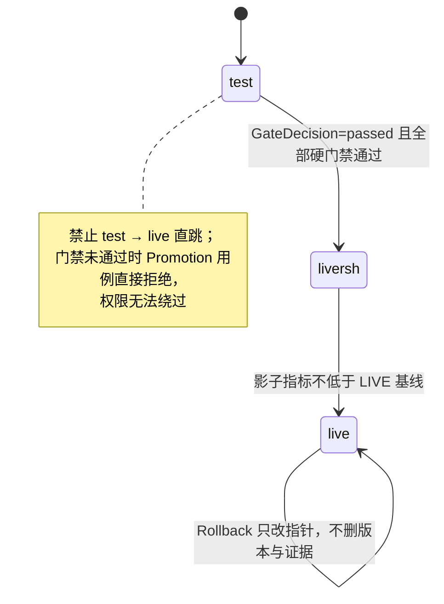
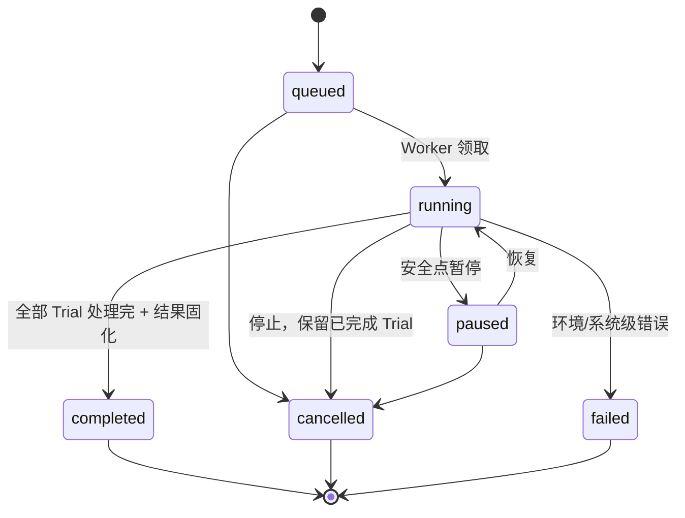

# Eval Loom 后端架构

> 本文依据 `frontend-pro/项目业务需求说明.md` 重写，是该后端**完全重写**的施工图。
> 旧 `backend/` 代码不作为实现依据：它按「Agent + Instance + Token + Run/Trial/Trace/Score」的窄口径编写，
> 缺少能力资产、数据集版本、评测策略、门禁、提案、三通道和权限模型，无法通过增量修改对齐业务。
>
> 覆盖范围：**P0 闭环拆到模块级与用例级；P1/P2/P3 只定义模块边界与预留接口。**
> 技术基线：Python 3.11+、FastAPI、SQLAlchemy 2.x、SQLite（开发）/ PostgreSQL（生产）。
> 组织形式：**垂直模块切片 + 契约层**，面向多人并行开发。

---

## 1. 从业务规则到架构机制

架构不是对页面的直译。需求说明第 9 章给出 18 条业务底线，每一条都必须在代码里有一个**结构性**的落点，
而不是靠开发自觉。下表是本文的推导依据：

| 业务规则（需求说明 §9） | 架构机制 | 落在哪一层 |
| --- | --- | --- |
| 1. 一切资源属于一个工作区，工作区之间隔离 | 所有聚合根强制带 `workspace_id`；仓储基类统一注入工作区过滤；请求上下文解析 `CurrentWorkspace` | domain + infrastructure + api |
| 2/3. 资产必须版本化，已用版本不可原地覆盖 | 版本表只插入不更新；`spec_digest` 唯一约束；改配置 = 建新版本 | domain |
| 4. 评测结果必须关联明确版本 + 数据集版本 + 评测规则 | `Run` 冻结 `subject_version_id` / `dataset_version_id` / `template_snapshot` 三件套 | domain + application |
| 5. Run 汇总不能代替 Trial 级证据 | `Run` 的聚合字段是**投影**，真相在 `Trial` / `Score` | domain + application |
| 6. Trace 必须能拆到 Span | `Trace` / `Span` / `TraceEvent` 三层，Span 树由 `parent_span_id` 还原 | domain |
| 7. 结束的 Run 结果固化 | `Run.status` 进入终态后写路径关闭；聚合结果落 `RunResult` 快照行 | domain + application |
| 8. 停止 Run 保留已完成 Trial | 停止是「不再派发新 Trial」，已落库 Trial 不回收 | application |
| 9. 门禁是硬约束，未通过不能晋级 | `GateEngine` 是纯函数；晋级用例必须持有通过态 `GateDecision`；**权限无法绕过门禁** | domain + application |
| 10. 版本只能 TEST→LIVESH→LIVE | `ChannelBinding` 指针 + `PromotionPolicy` 状态机，禁止跨通道直跳 | domain |
| 11. LIVESH 只做影子执行 | `ShadowRoute.direction = copy_in_only`，影子输出写 Trace 但不进 `invoke` 响应 | application + api/gateway |
| 12. LIVE 回退指向历史版本，不删证据 | 回退 = 更新 `ChannelBinding` 指针 + 写 `Rollback` 审计行 | application |
| 13/14. 自动改进只能先成提案，接受后只产生 TEST 候选 | 自动主体只有 `proposal:submit`，**永远没有** `proposal:review` 与 `version:promote:*`；接受动作只能创建 `lifecycle=draft` 版本 | domain（`Authorizer` 硬约束） |
| 15. 凭证按工作区隔离，明文只展示一次 | 明文仅在创建响应返回；库中只存哈希 + 末四位 + 前缀 | application + infrastructure |
| 16. 凭证有可用/将过期/已吊销状态并可轮换 | `Credential.status` 由 `expires_at` 与吊销时间派生，轮换 = 新建 + 吊销旧 | domain |
| 17. 负责人与绑定关系决定责任和影响范围 | 资产 `owner_id` 必填并参与资源级鉴权；`AssetBinding` 支撑影响面查询 | domain + application |
| 18. 质量不能只看成功率 | 指标读模型强制分列：成功率 / 能力得分 / 延迟 / 成本 / 安全信号，禁止裸 `success_rate` | application（读模型） |

### 需求说明 §12/§16 未决口径的架构应答

产品文档把若干问题标为「编码前必须确认」。架构层面对能确定的部分先给出结构化承接，未定的部分留开关：

| 未决项 | 架构承接方式 |
| --- | --- |
| §12.2 Run 如何获得策略 | `Run.template_snapshot` 无条件冻结；`snapshot_source ∈ {explicit, derived_from_binding, ad_hoc}` 记录来源 |
| §12.3 数据集分类混合维度 | 拆成两个正交字段：`source_purpose ∈ {benchmark, regression, production_trace}` + `task_shape ∈ {single_turn, multi_turn, agentic}` |
| §12.4 维度得分缺范围 | `Score.scope` 必填：`{kind: run \| asset_version \| workspace_window, ref_id, window}` |
| §12.7 成功率口径 | 读模型只暴露 `invocation_success_rate` / `task_success_rate` / `tool_success_rate` / `gate_pass_rate`，无泛化字段 |
| §12.8 LIVESH 比例含义 | `ShadowRoute.sample_rate` 只表示「复制进影子的比例」，方向由 `direction` 显式固定 |
| §16.2 策略来源 | 见上表 `snapshot_source`，三种来源共存 |
| §16.3 门禁作用于什么动作 | 门禁作用于 `Promotion`（晋级）与 `AssetBinding`（引用新版本）两个用例，不自动回退生产 |
| §16.4 生产 Trace 如何进数据集 | `RegressionSample` 用例：选择 Trace → 脱敏 → 落数据集草稿 → 人工补期望 → 固化新版本 |
| §16.5 谁能审查提案和发布版本 | 见 §5 权限矩阵；默认「evaluator 可审查、owner 可发布到 LIVE」 |
| §16.7 LLM Judge 可信度 | `Score.determinism ∈ {deterministic, probabilistic}`；`GateRule.required_determinism` 可强制高风险维度只用确定性评估器 |
| §16.8 失败与未通过的区别 | `Trial.execution_status` 与 `Trial.verdict` 两个正交字段，不合并成单个 status |

### 两个隔离轴：Workspace 与 Tenant

被测 Agent 已经部署上线，**它服务的业务租户是多个**。因此系统有两条正交的隔离轴，
任何一条没管住都是数据泄露：

| 轴 | 含义 | 挂在哪些对象上 | 从哪进入系统 |
| --- | --- | --- | --- |
| **Workspace** | 平台侧的治理单位：谁在平台上管理哪些 Agent、数据集、策略 | `Asset` / `Dataset` / `Template` / `Run` | 登录后由 `x-workspace-id` 决定 |
| **Tenant** | Agent 运行时的业务分区：这条调用 / 这份知识 / 这个样本属于哪个客户 | `Trace` / `Span` / `Score` / 租户级资产 | 调用 Token、SDK 事件、Trace 回流 |

三条硬约束：

1. **生产 Trace 必须带 `tenant_id`**。否则跨租户数据在平台里混成一锅，无法按租户定位退化。
2. **调用凭证按 `(agent, tenant)` 签发**。一个租户的 Token 不能代表另一个租户发起调用。
3. **聚合指标会掩盖单租户退化**。整体通过率 95% 仍可能某个租户全挂，因此门禁支持按租户判定。

> 与需求说明的对应：§12.4「维度得分必须有统计范围」在这里落为 `Score.scope` 增加租户维度；
> §10.1「生产调用 Trace」在多租户下必须能按租户切片；§9.1「工作区之间必须隔离」之外，
> 还需要同等工作强度的**租户之间必须隔离**。

---

## 2. 平面划分与进程边界

系统由三个平面组成，**进程边界即信任边界**：



**边界规则**

- API 进程**不 import、不执行**上传的 Agent 代码包；代码包只作为制品进入执行面。
- 请求线程只做：校验 → 冻结快照 → 事务落库 → 命令入队。任何耗时执行都在 Worker。
- Worker 是控制面与执行面的唯一连接点，替换 Runtime 不侵入业务用例。
- 三个 API 面鉴权模型互不共用：会话/工作区角色、`evl_` 部署 Token、`evk_` 接入密钥（**只写 Trace**）。

### 2.1 进程拆分

**同一份代码、同一个数据库、四个入口**。拆进程的目的是隔离故障与独立扩容，不是拆数据。

| 进程 | 入口 | 职责 | 扩容维度 | 阶段 |
| --- | --- | --- | --- | --- |
| `api-console` | `runtime/api_console.py` | 控制台 API | 请求数 | P0 |
| `api-gateway` | `runtime/api_gateway.py` | 业务调用（生产关键路径） | QPS / 延迟 | P0（可先与 console 合并） |
| `ingest` | `runtime/ingest.py` | Trace NDJSON 写入 | 写入吞吐 | P0 |
| `worker` | `runtime/worker.py` | Run/Trial 执行、评分、门禁 | 并发 Trial 数 | P0 |
| `scheduler` | `runtime/scheduler.py` | 定时/事件触发 | — | P3 |

**为什么不直接上微服务**：P0 的核心写路径是「冻结快照 + 落库 + 入队」必须在一个事务里，
跨服务会立刻引入分布式事务；控制台的读模型需要跨模块 JOIN，拆开后要建同步管道。
当前阶段模块化单体 + 多进程的收益接近微服务，成本低一个数量级。

**将来要拆的时候怎么拆**：模块边界已经写在 `contracts/` 里，
把 `modules/<name>/` 整体移出并换掉 `container.py` 的绑定即可，业务用例零改动。

> 进程拓扑、k8s 迁移检查单、命令/事件队列的投递语义见 **[backend-runtime.md](backend-runtime.md)**。

---

## 3. 模块切分与依赖规则

### 3.1 垂直切片，不按水平分层切

**反例**（五个人会同时改同一批目录，必然冲突）：

```text
app/domain/{identity,asset,dataset,...}/     ← 五个人都往这里加文件
app/application/{identity,asset,...}/
app/infrastructure/{...}/
```

**采用**（一人一模块，目录不重叠）：

```text
modules/<name>/{domain,application,infrastructure,api}/   ← 一个人拥有整条竖切
contracts/<name>/                                          ← 模块对外的唯一接口
```

### 3.2 依赖规则

```text
api/ ──→ application/ ──→ domain/
                │              ↑
                ↓              │
        application/ports/ ────┘
                ↑
        infrastructure/（实现 ports）
                ↑
        container.py（组合根，唯一知道具体实现的地方）

跨模块：modules/A ──→ contracts/B ←── 由 modules/B 实现
```

| 规则 | 说明 |
| --- | --- |
| R1 | 模块内部保持 `api → application → domain`，`domain` 不依赖任何框架 |
| R2 | **模块之间只能通过 `contracts/` 通信**，禁止 `import modules.B.domain` / `modules.B.infrastructure` |
| R3 | 跨模块**禁止直接 JOIN 对方的表**；需要的数据由对方发布 Port，或由读模型模块组装 |
| R4 | 跨模块副作用走**领域事件 + Outbox**，不让 A 同步调用 B 的用例 |
| R5 | Port 由**消费方**定义（依赖倒置）：B 需要 A 的数据，B 在 `contracts/` 声明 Protocol，A 提供适配器 |
| R6 | `domain/` 的 import 集合不得含 `fastapi` / `sqlalchemy` / `httpx` |

R1–R3、R6 由 `tests/architecture/` 的静态检查强制，CI 失败即阻断合并。

### 3.3 模块清单与所有权

| 模块 | 职责 | 拥有者 | 依赖 | 阶段 |
| --- | --- | --- | --- | --- |
| `identity` | 用户、会话、工作区、成员、角色、权限判定 | Track A | — | P0 |
| `asset` | Agent/Skill/MCP/知识库、不可变版本、三通道指针、凭证、制品 | Track B | identity | P0(agent) / P2 |
| `dataset` | 数据集、导入预检、样本复核、版本固化 | Track C | identity | P0 |
| `evaluation` | 能力/维度/评估器目录、评测策略、门禁规则 | Track C | identity, asset | P0 |
| `execution` | Run、Trial、命令队列、Worker 编排 | Track D | asset, dataset, evaluation | P0 |
| `observability` | Trace/Span 写入与查询、指标读模型、成本 | Track E | identity, asset | P0 |
| `improvement` | 提案、审查、回归样本沉淀 | Track F | asset, dataset, observability | P0(样本) / P1 |
| `delivery` | 晋级、影子路由、发布、回退 | Track F | asset, evaluation, observability | P1 |

`runtime`（RuntimePort 的适配器实现）不归属任何业务模块，由 Track D 维护。

---

## 4. 目录结构

```text
backend/
├── app/
│   ├── shared/                      # 技术内核，无业务含义，Track 0 冻结
│   │   ├── ids.py                   # 带前缀的有序 ID（agent_ / run_ / trial_ / trc_ …）
│   │   ├── clock.py                 # Clock 抽象，测试可注入固定时间
│   │   ├── errors.py                # 错误基类与错误码
│   │   ├── pagination.py            # 游标分页（Trace 量大，不用 offset）
│   │   ├── canonical_json.py        # 规范化 JSON + sha256，用于 spec_digest
│   │   ├── redaction.py             # 字段级脱敏（token/cookie/authorization/api_key）
│   │   └── security/                # argon2、Fernet、CSRF token、token 哈希
│   │
│   ├── contracts/                   # ★ 跨模块契约：DTO + Protocol + 领域事件
│   │   │                            #   冻结后改动需评审；新增字段只能追加
│   │   │                            #   详细草案见 docs/backend-contracts.md
│   │   ├── common.py                # 分页、ID 类型、通用枚举
│   │   ├── events.py                # 领域事件目录（见 §4.1）
│   │   ├── identity/                # CurrentUser, WorkspaceRef, Permission, AuthorizerPort
│   │   ├── asset/                   # AssetRef, AssetVersionRef, Channel, AssetVersionSpecPort
│   │   ├── dataset/                 # DatasetVersionRef, SampleRef, SampleReaderPort
│   │   ├── evaluation/              # TemplateSnapshot, EvaluatorSpec, GateRuleSpec
│   │   ├── execution/               # RunRef, TrialRef, CommandEnvelope
│   │   ├── observability/           # TraceIngestPort, TraceQueryPort, ScoreRef
│   │   ├── improvement/             # ProposalRef, RegressionSamplePort
│   │   └── delivery/                # PromotionRequest, ChannelRouterPort（P1）
│   │
│   ├── modules/                     # ★ 垂直切片，一人一模块
│   │   ├── identity/
│   │   │   ├── domain/              # User, Session, Workspace, Membership, Role, PermissionSet
│   │   │   │   ├── identity_provider.py   # IdP 配置、FederatedIdentity、RoleMapping
│   │   │   │   └── authorizer.py          # 权限判定纯函数
│   │   │   ├── application/         # 登录、登出、会话、成员管理、角色映射
│   │   │   ├── infrastructure/
│   │   │   │   ├── auth/local_password.py # AuthProviderPort 实现
│   │   │   │   ├── auth/oidc.py           # AuthProviderPort 实现
│   │   │   │   └── auth/jwks_cache.py     # 按 kid 缓存并轮转
│   │   │   └── api/                 # /auth/*, /auth/oidc/*, /workspaces/*, /members/*
│   │   ├── asset/
│   │   │   ├── domain/              # Asset, AssetVersion, ChannelBinding, Credential, Artifact
│   │   │   │   ├── spec/            # 每类资产的 spec 校验
│   │   │   │   │   ├── agent.py     # P0
│   │   │   │   │   ├── skill.py     # P2
│   │   │   │   │   ├── mcp.py       # P2
│   │   │   │   │   └── knowledge_base.py  # P2
│   │   │   │   └── lifecycle.py     # 通道指针与晋级状态机
│   │   │   ├── application/
│   │   │   ├── infrastructure/      # transport/：github / package / sdk 取件
│   │   │   └── api/
│   │   ├── dataset/
│   │   ├── evaluation/
│   │   ├── execution/
│   │   ├── observability/
│   │   ├── improvement/
│   │   └── delivery/                # P1
│   │
│   ├── runtime_adapters/            # RuntimePort 实现：local_sandbox / docker / k8s / remote_http
│   ├── persistence/                 # 共享：引擎、Session、UnitOfWork 基类、迁移
│   │   └── migrations/<module>/     # 已废弃：改用 backend/migrations/ + branch_labels，见 §13
│   ├── container.py                 # 组合根：把 Port 绑到 Adapter
│   ├── settings.py                  # pydantic-settings；主密钥只从环境注入
│   └── schemas/                     # API 响应封装：{success, data, errorCode, ...}
│
├── runtime/                         # 进程入口（每个入口约 20 行）
│   ├── api_console.py
│   ├── api_gateway.py
│   ├── ingest.py
│   ├── worker.py
│   └── scheduler.py                 # P3
│
└── tests/
    ├── architecture/                # R1–R3、R6 的静态检查
    ├── contracts/                   # 契约测试：每个模块的 Port 是否满足声明
    ├── unit/<module>/
    ├── integration/<module>/
    └── e2e/test_p0_closed_loop.py   # 需求说明 §14 的 13 条验收场景
```

### 4.1 领域事件目录

跨模块副作用统一走事件，消费者各自订阅，生产者不知道谁在用：

```text
identity       member.role_changed, member.removed, credential.*
asset          asset.created, asset.version.created, asset.channel.bound
dataset        dataset.version.finalized, dataset.import.failed
evaluation     template.created, template.updated, template.disabled
execution      run.created, run.started, run.paused, run.resumed,
               run.cancelled, run.completed, run.failed,
               trial.started, trial.execution_failed, trial.scored
observability  trace.ingested, score.emitted, metrics.threshold_breached
improvement    proposal.created, proposal.reviewed, regression_sample.created
delivery       promotion.requested, promotion.blocked, promotion.approved, version.rolled_back
```

事件与业务写入**同事务**落 Outbox（`event_outbox` 表），由 Worker 投递。P0 用进程内分发即可，
但**接口按跨进程设计**（事件带 `event_id`、`occurred_at`、`workspace_id`、`aggregate_id`、`sequence`），
将来换消息队列不改业务代码。

---

## 5. 身份、认证与权限

### 5.1 认证（AuthN）：多 Provider 可插拔

**企业 SSO 是既定需求，不是后补项**。因此认证从第一天就走 `AuthProviderPort`，
本地密码只是其中一个 Provider，OIDC 是另一个，二者产出**同一种会话**。

```python
class AuthProviderPort(Protocol):
    kind: Literal["local", "oidc"]
    async def begin(self, redirect_uri: str, state: str) -> AuthChallenge: ...
    async def complete(self, callback: CallbackParams) -> ExternalIdentity: ...

@dataclass(frozen=True)
class ExternalIdentity:
    provider_id: str          # 哪个 IdP
    subject: str              # OIDC sub，稳定唯一，联邦身份的主键
    email: str | None
    email_verified: bool
    display_name: str | None
    groups: tuple[str, ...]   # 用于 group → 工作区角色映射
```

| 项 | 设计 |
| --- | --- |
| 本地登录 | `POST /api/v1/auth/login` `{identifier, password}`；identifier 支持用户名或邮箱 |
| SSO 登录 | 授权码 + PKCE（S256），见 §5.1.1 |
| 会话 | HttpOnly + Secure + SameSite=Lax Cookie；服务端存 `session(id, user_id, token_hash, auth_method, provider_id, expires_at, last_seen_at, ua, ip)` |
| 登出 | `POST /api/v1/auth/logout` 吊销会话行；SSO 会话额外走 RP-initiated logout（§5.1.2） |
| 密码 | argon2id；`password_hash` 永不出现在任何 DTO |
| CSRF | Cookie 会话下写操作必须带 `X-CSRF-Token`（双提交校验）；`evl_` / `evk_` 机器凭证豁免 |
| 会话过期 | 空闲 4 小时过期（`last_seen_at` 刷新），绝对上限 24 小时；均可配置 |
| 断链兜底 | 保留一个本地 break-glass 管理员账号，IdP 故障时可登录 |

#### 5.1.1 OIDC 登录流程

```text
前端  GET /api/v1/auth/oidc/{provider}/authorize?redirect_uri=...
       └→ 后端生成 state + nonce + code_verifier，暂存（10 分钟 TTL）
       └→ 302 到 IdP 授权端点
IdP   用户认证（MFA 由 IdP 负责，平台不重复实现）
       └→ 302 回 /api/v1/auth/oidc/{provider}/callback?code=&state=
后端  校验 state → 换 token → 验 id_token 签名与 claims
       └→ 解析 ExternalIdentity → 联邦身份 upsert → 解析 groups → 工作区角色
       └→ 重新签发会话（防会话固定）→ Set-Cookie → 302 回前端
```

**必须校验的项**（缺一不可）：`state` 一次性比对、`nonce`、PKCE `code_verifier`、
id_token 签名（JWKS 按 `kid` 缓存并支持轮转）、`iss`、`aud`、`exp`/`iat`（允许 ±120s 时钟偏移）、
`email_verified`。`redirect_uri` 走**配置白名单**，不接受请求参数动态指定。

#### 5.1.2 联邦身份与 JIT 开户

```python
class IdentityProvider:            # 一个部署可配多个 IdP（不同业务单元）
    id: str
    kind: Literal["local", "oidc"]
    display_name: str
    issuer: str | None
    # discovery 兜底：自建 IdP 若不提供 .well-known，则手填以下端点
    authorization_endpoint: str | None
    token_endpoint: str | None
    jwks_uri: str | None
    end_session_endpoint: str | None
    client_id: str | None
    client_secret_ref: str | None  # 只存引用，密钥进 Vault
    scopes: tuple[str, ...]        # 默认 ("openid","profile","email","groups")
    groups_claim: str              # 默认 "groups"，自建 IdP 可自定义
    pkce_required: bool            # 默认 True
    allowed_email_domains: tuple[str, ...]
    auto_provision: Literal["disabled", "on_first_login"]
    enabled: bool

class FederatedIdentity:           # (provider_id, subject) → user_id
    provider_id: str
    subject: str
    user_id: str
    email: str | None
    last_login_at: datetime
```

**已定的默认值**（本文档直接采用，不再逐项问产品）：

| 决策 | 取值 | 理由 |
| --- | --- | --- |
| `auto_provision` | `on_first_login`，但**必须** `email_verified=true` 且邮箱域在 `allowed_email_domains` 内 | 自建 IdP 即公司目录，JIT 免去逐个开户；白名单挡住外部邮箱 |
| `allowed_email_domains` | **部署配置项；空列表 = 关闭 JIT**（只能管理员邀请） | 不硬编码域名；配置缺失时默认安全 |
| 新用户初始工作区 | **不给**。只有 `RoleMapping` 命中或管理员邀请才获得成员资格 | 登录成功 ≠ 有权限，避免「全员可见」 |
| `RoleMapping` 未命中 | 该 Provider 的默认角色，默认 **无成员资格** | 比默认 `viewer` 更安全 |
| `groups_claim` | 默认 `groups`，可配置 | 自建 IdP 的 claim 名可能不同 |
| SSO 强制 | 全局 `AUTH_REQUIRE_SSO` 默认 false，生产建议 true；工作区可覆盖；break-glass 账号永久豁免 | 开发期不阻塞，生产收紧 |

- **身份绑定以 `(provider_id, subject)` 为准**，不用邮箱——邮箱可被改，`sub` 不会。
- **`Group → Role` 映射**：`RoleMapping(provider_id, external_group, workspace_id, role)`；
  每次登录按 groups 重算工作区角色，**立即生效**（覆盖手工调整）。
- **本地账号与 SSO 账号可以是同一个人**：`FederatedIdentity` 允许多条记录指向同一个 `user_id`。

#### 5.1.3 会话吊销

| 场景 | 行为 |
| --- | --- |
| 用户主动登出 | 吊销本地会话；若是 SSO，再触发 RP-initiated logout |
| IdP 单点登出 / back-channel logout | 校验 IdP 签名后吊销该 subject 的全部本地会话 |
| 成员被移除 / 角色被改 | 吊销该用户在该工作区的全部会话 |
| 用户被停用 | 吊销全部会话；`User.status=disabled` 后任何 Provider 都拒绝登录 |
| 绝对超时 | 24 小时到点强制重新认证 |

> **离职停用怎么兜底**：不引入 SCIM。靠「IdP 单点登出 + 管理员停用 + 24h 绝对超时」三条。
> 只有审计要求「离职后秒级失效」时，才需要 SCIM 或强制 back-channel logout。

#### 5.1.4 对自建 IdP 的能力要求

既然是自建，下面这份清单就是 **IdP 团队要实现的接口契约**。缺哪一项，平台侧都有对应降级：

| 能力 | 必要性 | 缺失时的降级 |
| --- | --- | --- |
| Authorization Code + PKCE (S256) | 必须 | 无法安全登录，不接受 |
| 稳定不变的 `sub` | 必须 | 身份绑定失效，退化为邮箱匹配（不安全） |
| `email` + `email_verified` | 必须 | JIT 关闭，只能管理员邀请 |
| `groups` claim（名字可配） | 必须 | `RoleMapping` 失效，全部走管理员手工授权 |
| JWKS 端点 + `kid` 轮转 | 必须 | 无法验签，不接受 |
| `nonce` 校验 | 必须 | 无法防重放，不接受 |
| OIDC Discovery（`/.well-known/openid-configuration`） | 推荐 | 手填四个端点（表结构已留字段） |
| RP-initiated logout（`end_session_endpoint`） | 推荐 | 只能吊销本地会话，IdP 侧仍在线 |
| `prompt=login` / `max_age` | 推荐 | 敏感操作再认证降级为二次确认弹窗 |
| Back-channel logout | 可选 | 依赖 24h 绝对超时兜底 |

#### 5.1.5 高风险操作的再认证（P1）

晋级 LIVE、生产回退属于不可逆动作。**MFA 归 IdP，平台不重复实现**，平台只做「再认证」：

```text
用户点击「发布到 LIVE」
  → 无有效 re-auth ticket → 跳 IdP 重新认证（prompt=login 或 max_age=0）
  → 回跳后签发 re-auth ticket（TTL 5 分钟，绑定 user + 目标动作）
  → 携带 ticket 才能执行晋级/回退
```

若自建 IdP 暂不支持 `prompt=login`，降级为「输入当前密码 + 输入目标版本号二次确认」。
**这是权限之外的独立闸门**：有 `version:promote:live` 权限的人，仍要过这一关。

**四条互不混用的鉴权链**

| 凭证 | 用途 | 权限 | 生命周期 |
| --- | --- | --- | --- |
| 会话 Cookie | 控制台 | 工作区角色 + 租户范围 | 滑动过期 |
| `evl_` 部署 Token | 调用已部署 Agent | 只能 `invoke` 指定 `(agent, tenant)` | 可吊销、可轮换 |
| `evk_` 接入密钥 | SDK 上报 Trace | **只写 Trace**，不能调用 Agent | 可吊销、可轮换 |
| `evs_` 租户同步密钥 | 调用侧同步租户清单 | 只能 `tenant:sync` | 可吊销、可轮换 |

### 5.2 授权（AuthZ）：三层模型

需求 §16.5 问「谁能审查提案和发布版本」。答案是三层叠加，而不是单一角色：

```text
第 1 层 工作区角色（WorkspaceRole）      → 基线权限点集合
第 2 层 资源负责人（resource.owner_id）  → 对自己负责的资源额外放权
第 3 层 显式授权（Grant）                → 例外场景的定向授权，可设过期
```

**工作区角色**

| 角色 | 定位 |
| --- | --- |
| `owner` | 工作区所有者：成员、设置、生产发布、回退 |
| `admin` | 管理员：除工作区转移/删除外的全部 |
| `evaluator` | 评测负责人：数据集、策略、门禁、Run、提案审查 |
| `developer` | Agent 开发者：接入 Agent、建版本、发起 Run、提交提案 |
| `viewer` | 只读 |

**权限点矩阵**（`✓*` = 仅对自己负责的资源生效）

| 权限点 | owner | admin | evaluator | developer | viewer |
| --- | :---: | :---: | :---: | :---: | :---: |
| `workspace:read` | ✓ | ✓ | ✓ | ✓ | ✓ |
| `workspace:settings:write` | ✓ | ✓ | | | |
| `member:invite` / `member:role:write` / `member:remove` | ✓ | ✓ | | | |
| `asset:read` / `dataset:read` / `template:read` / `run:read` / `trace:read` | ✓ | ✓ | ✓ | ✓ | ✓ |
| `asset:create` / `asset:update` / `asset:archive` | ✓ | ✓ | | ✓ | |
| `asset:version:create` | ✓ | ✓ | | ✓* | |
| `asset:credential:create` / `:revoke` | ✓ | ✓ | | ✓* | |
| `dataset:create` / `dataset:import` | ✓ | ✓ | ✓ | | |
| `dataset:version:finalize` / `dataset:export` | ✓ | ✓ | ✓ | | |
| `template:create` / `:update` / `:disable` / `:bind` | ✓ | ✓ | ✓ | | |
| `gate:configure` | ✓ | ✓ | ✓ | | |
| `run:create` | ✓ | ✓ | ✓ | ✓ | |
| `run:control`（暂停/恢复/停止） | ✓ | ✓ | ✓ | ✓* | |
| `proposal:submit` | ✓ | ✓ | ✓ | ✓ | |
| `proposal:review` | ✓ | ✓ | ✓ | | |
| `version:promote:livesh` | ✓ | ✓ | ✓ | | |
| `version:promote:live` | ✓ | | | | |
| `version:rollback` | ✓ | | | | |
| `shadow:configure` | ✓ | ✓ | | | |
| `trace:read_raw`（未脱敏内容） | ✓ | ✓ | | | |
| `tenant:export` / `tenant:purge` | ✓ | | | | |

> `tenant:sync` 不在本表：它只由机器凭证 `evs_` 持有，任何用户角色都不具备。

**四条硬规则**

1. **门禁与权限正交**。有 `version:promote:livesh` 只是「能点这个按钮」；门禁未通过一律拒绝晋级。
   权限管谁能操作，门禁管操作能不能成功。任何代码路径都不得用权限绕过门禁。
2. **工作区隔离优先于角色**。先校验 `x-workspace-id` 的成员资格，再判角色；两者都过才进入用例。
3. **资源负责人不越界**。`✓*` 类权限只在 `resource.owner_id == current_user.id` 时生效，
   不扩大工作区级权限。
4. **自动主体只读只提**。`Proposal.author_type ∈ {agent, monitor, human}`；
   当主体是 `agent` / `monitor` 时，`Authorizer` 强制拒绝 `proposal:review` 与所有 `version:promote:*`
   ——这是需求 §9.13「自动生成的改进不能直接修改生产版本」的**代码级保证**，不是流程约定。

### 5.3 授权实现位置

| 位置 | 职责 |
| --- | --- |
| `modules/identity/domain/permission.py` | 权限点常量、角色→权限映射表（纯数据） |
| `modules/identity/domain/authorizer.py` | `Authorizer.decide(subject, action, resource) -> Decision`，纯函数 |
| `modules/<name>/api/deps.py` | `require("asset:version:create")` 依赖：解析会话 + 工作区 + 角色 |
| `modules/<name>/application/guard.py` | 资源级判定（需先加载资源，拿到 `owner_id`） |
| `contracts/identity/` | `AuthorizerPort`、`CurrentUser`、`Permission` —— 其他模块只依赖契约 |

**敏感动作全部写审计**：晋级、回退、门禁配置变更、凭证创建/吊销、成员角色变更、提案审查、
原始 Trace 读取。审计行不可变，带 `actor_id` / `actor_type` / `workspace_id` / `action` / `target` / `at`。

### 5.4 租户级授权（第二道边界）

工作区角色决定「能不能用某类功能」，租户范围决定「能看到哪个租户的数据」。两者相乘：

```python
class Membership:
    workspace_id: str
    user_id: str
    role: WorkspaceRole
    tenant_scope: Literal["all"] | tuple[str, ...]   # 默认 "all"，可收窄到指定租户
```

判定顺序：**工作区成员资格 → 租户范围 → 角色权限 → 资源级 owner**，任一不满足即拒绝。

| 场景 | 规则 |
| --- | --- |
| 查询 Trace | 只返回 `tenant_id ∈ membership.tenant_scope` 的行 |
| 生产 Trace 转回归样本 | 目标租户必须在范围内；跨租户样本需额外确认 |
| 创建 Run | `run.tenant_scope` 必须是 membership 范围的子集 |
| 查看租户级门禁结果 | 同上 |
| 导出 / 删除租户数据 | 需 `tenant:export` / `tenant:purge`，默认仅 owner |

**读模型统一收口**：所有列表查询经 `observability` 的读模型，在 SQL 层就带上 `tenant_id IN (...)`。
**不允许先查全量再在应用层过滤**——后者迟早漏。

---

## 6. 领域模型拆分

### 6.1 限界上下文与聚合

| 模块 | 聚合 | 优先级 | 职责 |
| --- | --- | --- | --- |
| `identity` | `User`, `Session`, `Workspace`, `Membership`, `Tenant` | P0 | 身份、会话、工作区隔离、租户登记、成员与角色 |
| `asset` | `Asset`, `AssetVersion`, `ChannelBinding`, `Credential`, `Artifact` | P0(agent)/P2 | 资产台账、不可变版本、三通道指针 |
| `dataset` | `Dataset`, `DatasetVersion`, `DatasetItem`, `ImportSession` | P0 | 样本集合、导入预检、复核、版本固化 |
| `evaluation` | `Capability`, `ScoreDimension`, `Evaluator`, `EvaluationTemplate`, `GateRule` | P0 | 能力/维度/评估器分层，策略编排 |
| `execution` | `Run`, `Trial`, `RunResult` | P0 | 一次实验的冻结、派发、推进、固化 |
| `observability` | `Trace`, `Span`, `Score`, `Evidence`, `CostRecord` | P0 | 执行事实、评分证据、成本与延迟 |
| `improvement` | `Proposal`, `ProposalReview`, `RegressionSample` | P0(样本)/P1 | 生产问题回流 |
| `delivery` | `Promotion`, `ShadowRoute`, `Rollback` | P1 | 晋级、影子验证、发布、回退 |

### 6.2 核心决策：四类资产共用一套「版本 + 通道」骨架

需求 §6.1 明确 TEST / LIVESH / LIVE 通道**同时适用于 Agent、Skill、MCP 和知识库**，
§7.8 明确三者「共用一套治理流程」。因此不建四套平行模型：

```python
class Asset:                    # 长期存在的业务身份
    id: str
    workspace_id: str
    kind: Literal["agent", "skill", "mcp", "knowledge_base"]
    name: str
    description: str
    owner_id: str               # §9.17 负责人，同时是资源级鉴权依据
    lifecycle: Literal["draft", "active", "archived"]
    source: AssetSource         # kind=agent 时有意义：github / package / sdk

class AssetVersion:             # 不可变实现快照
    id: str
    asset_id: str
    version_label: str          # 语义化版本，如 2.6.0
    spec: Mapping[str, Any]     # 按 kind 校验的结构化配置
    spec_digest: str            # sha256(canonical_json(spec))，唯一约束
    lifecycle: Literal["draft", "evaluating", "ready", "blocked", "retired"]
    created_by: str
    created_at: datetime

class ChannelBinding:           # 指针：某通道当前指向哪个版本
    asset_id: str
    channel: Literal["test", "liversh", "live"]
    version_id: str | None
    bound_at: datetime
    bound_by: str
```

**权衡**：P0 只实现 `kind=agent`，但表结构从一开始就带 `kind` 判别列与 `spec` JSON 列。
P2 接入 Skill / MCP / 知识库时**只新增 spec 校验器与各自的评测维度**，不改表、不改通道逻辑。

前端已固化的三类 spec 形状直接对齐：

```text
SkillVersionSpec     { kind, instructions, input_schema, output_schema,
                       allowed_tools[], max_steps, timeout_ms }
McpVersionSpec       { kind, endpoint, transport(stdio|sse|streamable-http),
                       authentication{type, secret_ref}, tools[{name, description, input_schema}] }
KnowledgeVersionSpec { kind, embedding_model, index_name,
                       chunk_strategy{mode, size, overlap},
                       retrieval{mode, top_k, reranker},
                       sources[{id, name, connector, uri, enabled}] }
```

### 6.3 聚合与不变量

| 聚合根 | 关键不变量 |
| --- | --- |
| `Workspace` | 所有子资源必须带同一 `workspace_id`；跨工作区引用一律拒绝 |
| `User` | 密码哈希不出 DTO；停用用户不能新建会话 |
| `Asset` | `owner_id` 必填；同一工作区同名 `kind` 不重复 |
| `AssetVersion` | 落库后 `spec` 与 `spec_digest` 不可变；同一资产下 `version_label` 唯一 |
| `ChannelBinding` | 每 `(asset_id, channel)` 至多一行；指向的版本必须属于同一资产 |
| `Dataset` | 已被 `Run` 引用的 `DatasetVersion` 不可变；样本改动只能产生新版本 |
| `EvaluationTemplate` | 停用后不参与自动触发与门禁；历史执行结果保留 |
| `Run` | 冻结三件套后不可改；终态后拒绝任何写入 |
| `Trace` | append-only；同一 `(asset_id, external_trace_id, event_id)` 幂等 |
| `Score` | 不可变；`scope` 与 `evidence` 必填 |
| `Proposal` | 与 `ChannelBinding` 之间无写路径；接受后只能创建 `lifecycle=draft` 版本 |

### 6.4 状态机

> **命名警告**：业务里存在三个都叫「lifecycle / 状态」的东西，代码里必须用不同字段名：
> `AssetVersion.lifecycle`（版本自身）、`ChannelBinding.channel`（部署通道）、
> `EvaluationTemplate.stage`（评测阶段）。前端原型把后两者都叫 `lifecycle`，重写时必须拆开。

**版本生命周期**（`AssetVersion.lifecycle`）



**通道晋级**（`PromotionPolicy`，P1）



**Run 状态**（需求 §7.5）



`Run.stage` 单独表达 §7.5 的业务阶段：`provisioning → executing → scoring → completed`，
与 `status` 正交——暂停时 `stage` 停在原地，不丢失「做到哪一步」的信息。

### 6.5 三类 Trace 的建模

需求 §10 强调三类 Trace 不能混为一谈。用**同一张表 + 判别字段**建模，而不是三张表：

```python
class Trace:
    id: str
    workspace_id: str
    tenant_id: str | None                                    # 运行时租户；评测 Trace 取自样本
    origin: Literal["production", "shadow", "evaluation"]   # §10.1 / §10.2
    asset_id: str
    asset_version_id: str
    channel: Literal["test", "liversh", "live"] | None       # production / shadow 时有值
    run_id: str | None                                       # evaluation 时有值
    trial_id: str | None                                     # evaluation 时有值
    external_trace_id: str                                   # SDK 侧 trace_id，用于幂等
    status: Literal["success", "error", "timeout", "cancelled"]
    started_at: datetime
    ended_at: datetime | None
    duration_ms: int | None
    input_tokens: int
    output_tokens: int
    cost_usd: Decimal
    span_count: int
    ingested_via: Literal["sdk", "gateway", "runtime"]
```

§10.3 的「回流证据 Trace」**不是第四类**，而是 `ProposalEvidence(trace_id)` / `RegressionSample.source_trace_id`
的引用关系——同一行 Trace 被不同业务用途引用，不复制执行记录。

### 6.6 四类失败的建模

需求 §16.8 要求区分四种情况。做法是**正交字段**，不做单枚举：

```python
class Trial:
    execution_status: Literal["pending", "running", "succeeded", "failed", "timed_out", "cancelled"]
    verdict: Literal["pending", "pass", "fail", "skip", "error"] | None
```

| 业务口径 | 落在哪 |
| --- | --- |
| 执行失败（环境错误 / 模型超时 / 工具不可用） | `Trial.execution_status ∈ {failed, timed_out}`，`verdict` 保持空 |
| 质量未通过（任务完成但得分不达标） | `execution_status=succeeded` 且 `verdict=fail` |
| 运行失败（Run 系统性中断） | `Run.status=failed`，保留已完成 Trial |
| 门禁阻断（Run 正常完成但不许晋级） | `Run.status=completed` + `GateDecision.blocked` |

统计读模型按这四类分别出数，页面上不再出现含义模糊的「失败」。

### 6.7 多租户建模

**租户来源：以 Agent 调用侧为准，平台不手工维护**

```python
class Tenant:
    id: str
    workspace_id: str
    external_key: str              # 幂等键，由调用侧定义，如 "acme"
    name: str
    status: Literal["active", "suspended", "purged"]
    synced_at: datetime            # 最近一次同步时间
    created_at: datetime

class TenantBinding:               # 哪个 Agent 服务哪些租户
    agent_id: str
    tenant_id: str
    enabled: bool
```

- 调用侧通过 `PUT /v1/tenants` 增量 upsert（见 §9.4），**同步不隐含删除**，停用必须显式传 `suspended`。
- **未登记的 `external_key` 无法签发 `evl_` / `evk_` 凭证**，因此生产调用链上**不需要**额外的租户校验——
  陌生租户天然进不来。这是「先同步、后签发」的核心收益。
- 平台**不反向读取** Agent 系统的租户数据，避免双向依赖。

**资产是否租户相关**：

```python
class Asset:
    ...
    tenant_scope: Literal["workspace_shared", "tenant_bound"]
    tenant_id: str | None          # tenant_bound 时必填
```

| 资产 | 典型形态 | 说明 |
| --- | --- | --- |
| Agent | `workspace_shared` | 一个 Agent 服务多个租户 |
| Skill | 多为 `workspace_shared` | 通用任务能力 |
| MCP Server | 多为 `workspace_shared` | 工具服务 |
| 知识库 | 常为 `tenant_bound` | 每个租户的政策 / 文档不同，**不能跨租户检索** |

**评测也要按租户**：

```python
class Run:
    ...
    tenant_scope: Literal["all"] | tuple[str, ...]
```

**门禁的租户维度**：

| 门禁 | `scope` | 默认动作 | 理由 |
| --- | --- | --- | --- |
| 整体质量 | `workspace` | `block` | 全局退化必须阻断发布 |
| 单租户质量 | `tenant` | `warn` | 逐租户输出通过情况，避免「整体 95% 掩盖租户 B 全挂」 |

**小样本保护**：样本数 < `min_tenant_samples`（默认 30）的租户**只告警不阻断**——
小租户指标抖动大，直接阻断会误伤发布。这是「每租户单独达标」与「整体达标」之间的折中。

**凭证按租户签发**：`Credential.scope = (agent_id, tenant_id)`；
`evk_` SDK 密钥同样绑定租户，事件里携带的 `tenant_id` 必须与密钥一致，否则整批拒收。

**租户下线**：`tenant:purge` 默认**匿名化**（抹掉可识别字段，保留 Trace 结构与统计），
不物理删除——已固化的 Run 结果必须可复现，物理删除会破坏历史证据。
合规强制物理删除时走 `tenant:purge --hard`，需 owner 二次确认，并把相关 Run 标记为「证据不完整」。
由该租户 Trace 派生的回归样本：**产生新数据集版本剔除该租户样本**，
历史版本保留并标记来源已下线（数据集版本不可变，不能原地删样本）。

---

## 7. 应用层用例（P0）

用例 = 一个事务边界 = 一个命令。命名统一为 `动词 + 名词`，放在 `modules/<name>/application/`。

### 7.1 identity

| 用例 | 说明 |
| --- | --- |
| `LoginLocal` | 校验密码 → 建会话；失败计数与锁定；写登录审计 |
| `BeginOidcLogin` / `CompleteOidcLogin` | 生成 state/nonce/PKCE → 换 token → 验 id_token → upsert 联邦身份 → 重签会话 |
| `Logout` | 吊销会话；SSO 会话追加 RP-initiated logout |
| `ResolveProvider` | 按邮箱域返回可用 Provider 列表（登录页按钮用） |
| `SyncRolesFromGroups` | 登录时按 IdP groups 重算工作区角色 |
| `ListMyWorkspaces` | 只返回有权限的工作区 |
| `EnsureWorkspaceAccess` | 每个用例入口的守卫：资源 `workspace_id` 必须等于当前上下文 |
| `InviteMember` / `ChangeMemberRole` / `RemoveMember` | 成员管理，仅 owner/admin；变更后吊销目标用户的相关会话 |
| `Authorize` | `Authorizer.decide`，所有敏感用例前置调用 |

### 7.2 asset（P0 只做 agent）

| 用例 | 说明 |
| --- | --- |
| `RegisterAgent` | 三种接入方式（GitHub / 代码包 / SDK）→ 创建 `Asset` + 首个 `draft` 版本 |
| `FreezeAssetVersion` | 校验 spec → 计算 `spec_digest` → 落不可变版本 |
| `BindChannel` | 写/改 `ChannelBinding` 指针（P0 仅 test） |
| `CreateCredential` | 生成 `evk_` 明文，**仅本响应返回一次**，库存哈希 + 末四位 |
| `RevokeCredential` / `RotateCredential` | 吊销 / 新建并吊销旧凭证 |
| `QueryAssetImpact` | 反查「该资产被哪些 Agent 使用」（§9.17） |

### 7.3 dataset

| 用例 | 说明 |
| --- | --- |
| `StartImportSession` | 上传 JSON/JSONL/CSV → 结构预检：识别 input / expected_output / 重复项 / 无效样本 |
| `ReviewImportItem` | 处理重复、无效、需人工复核的样本 |
| `FinalizeDatasetVersion` | 预检通过 + 复核完成 → 固化不可变版本 |
| `ExportDatasetVersion` | 按版本导出（不按「当前数据集」） |

### 7.4 evaluation

| 用例 | 说明 |
| --- | --- |
| `CreateTemplate` / `UpdateTemplate` / `DisableTemplate` | 策略编排：阶段、触发、数据集版本、评估器、维度权重、门禁 |
| `BindTemplateToAsset` | 绑定策略到 Agent 或能力资产 |
| `EvaluateGateRules` | 纯函数：`(template_snapshot, run_results) → GateDecision` |

### 7.5 execution

| 用例 | 说明 |
| --- | --- |
| `CreateRun` | 校验被测版本 + 数据集版本 + 策略来源 → **冻结三件套** → 入队 `run.prepare` |
| `PauseRun` / `ResumeRun` / `CancelRun` | 协作式安全点；停止不回收已完成 Trial |
| `AdvanceRun` | Worker 用例：展开 Trial、按并发派发、汇总进度 |
| `ExecuteTrial` | Worker 用例：Runtime 调用被测版本 → 收集 Trace → 触发评分 |
| `FinalizeRun` | 终态固化：写 `RunResult` 快照，关闭写路径 |

### 7.6 observability & improvement

| 用例 | 说明 |
| --- | --- |
| `IngestTraceBatch` | NDJSON 幂等写入；单批 ≤1000 事件 / 5 MiB |
| `QueryTraces` | 按 `origin` / 状态 / 时间范围 / 关键词 / 版本筛选，游标分页 |
| `GetTraceTree` | 还原 Span 树 + 时间线；按 `trace:read_raw` 决定是否脱敏 |
| `ComputeAgentMetrics` | 24h 成功率、P95 延迟、Trace 量、成本（口径显式命名） |
| `CreateRegressionSample` | 失败 Trial 或生产 Trace → 脱敏 → 数据集草稿样本（§16.4） |
| `ReviewProposal`（P1） | 接受/拒绝；接受只能创建 `draft` 版本 |

---

## 8. 端口与适配器

端口是 `contracts/<module>/` 里的 `Protocol`，Adapter 在模块的 `infrastructure/` 实现，绑定在 `container.py`。

```python
class RuntimePort(Protocol):
    async def provision(self, spec: RuntimeSpec) -> RuntimeHandle: ...
    async def invoke(self, handle: RuntimeHandle, payload: InvokeInput) -> InvokeOutput: ...
    async def teardown(self, handle: RuntimeHandle) -> None: ...

class EvaluatorPort(Protocol):
    name: str
    version: str
    determinism: Literal["deterministic", "probabilistic"]
    async def evaluate(self, ctx: EvaluationContext) -> list[Score]: ...

class AuthorizerPort(Protocol):
    def decide(self, subject: Subject, action: Permission, resource: ResourceRef) -> Decision: ...

class UnitOfWork(Protocol):
    async def __aenter__(self) -> "UnitOfWork": ...
    async def commit(self) -> None: ...
    def enqueue(self, command: CommandEnvelope) -> None: ...   # 与业务写入同一事务
    def publish(self, event: DomainEvent) -> None: ...
```

| 端口 | P0 实现 | 后续实现 |
| --- | --- | --- |
| `RuntimePort` | `LocalSandboxRuntime`（确定性替身） | Docker / Kubernetes / RemoteHttp |
| `EvaluatorPort` | 确定性评估器（匹配、JSON Schema、工具名、工具成功、步长） | `LlmJudgeEvaluator` |
| `AuthorizerPort` | 角色矩阵 + 资源负责人判定 | 显式 `Grant`、ABAC 规则 |
| `ObjectStorePort` | 本地文件系统 | S3 兼容存储 |
| `CommandQueuePort` | SQLite Outbox | PostgreSQL `SKIP LOCKED` / 外部队列 |
| `CredentialVault` | Fernet + 外部主密钥 | KMS / Vault |
| `AuthProviderPort` | 本地密码 | OIDC / LDAP（P3） |

---

## 9. API 面与前端契约

### 9.0 控制台接口约定

前端原型 `frontend-pro` 已经固化了三件事，后端必须遵守（否则页面全部回退到演示数据）：

**统一响应封装**（`src/requestErrorConfig.ts`）

```json
{ "success": true, "data": { }, "errorCode": null, "errorMessage": null, "showType": 0 }
```

失败时 `success=false` + `errorCode` / `errorMessage` / `showType`，HTTP 状态码与业务错误码分离。

**工作区上下文**：不用路径参数，走请求头 `x-workspace-id` + `withCredentials` Cookie 会话。
后端在 `api/deps.py` 里解析该头并校验成员资格；缺省时回退到用户默认工作区。切换工作区是纯前端行为。

**路径前缀**：原型当前调用 `/api/agents`、`/api/runs`、`/api/policies`、`/api/datasets`、
`/api/capabilities`、`/api/evolution/*`、`/api/auth/*`。本架构规范化为 `/api/v1/*`，
重写时同步更新前端 `src/services/eval/index.ts` 与 `src/services/evolution/index.ts` 两个文件。
Gateway 与 Ingest 保持 `/v1/*` 不变。

**数值口径统一**：原型里 `EvalCapability.dimensions[].threshold` 按 0–100 用，
而 `EvalPolicy.gates` 的阈值按 0–1 用，同一概念两种量纲。后端统一为 **0–1 的比率**，
展示层负责乘 100；API 层用 pydantic `Field(ge=0, le=1)` 卡死，越界直接 422。

### 9.1 认证与成员（`/api/v1`）

| 方法 | 路径 | 权限 |
| --- | --- | --- |
| `POST` | `/auth/login` `/auth/logout` | 公开 / 已登录 |
| `GET` | `/auth/me` | 已登录（返回 `auth_method` / `provider`） |
| `GET` | `/auth/providers?email=` | 公开（登录页发现可用 IdP） |
| `GET` | `/auth/oidc/{provider}/authorize` | 公开 → 302 到 IdP |
| `GET` | `/auth/oidc/{provider}/callback` | 公开（IdP 回调，校验 state/PKCE） |
| `POST` | `/auth/oidc/{provider}/logout` | 已登录（RP-initiated logout） |
| `GET` | `/workspaces` | 已登录（只返回有权限的） |
| `GET/POST/PATCH/DELETE` | `/workspaces/{id}/members` | `member:*` |
| `GET/POST/PATCH/DELETE` | `/identity-providers` | `workspace:settings:write`（配置 IdP） |
| `GET/POST/PATCH/DELETE` | `/role-mappings` | `member:role:write`（group → 角色） |
| `GET` | `/me/permissions?workspace_id=` | 已登录（前端据此隐藏按钮） |

**前端改动**：登录页在密码表单旁增加「使用 SSO 登录」按钮；
输入邮箱后调 `/auth/providers?email=` 决定是否显示；`/auth/me` 增加 `auth_method` 字段。

### 9.2 控制台业务接口

| 方法 | 路径 | 所需权限 |
| --- | --- | --- |
| `GET/POST` | `/agents` | `asset:read` / `asset:create` |
| `GET/PATCH` | `/agents/{id}` | `asset:read` / `asset:update` |
| `GET/POST` | `/agents/{id}/versions` | `asset:read` / `asset:version:create` |
| `GET` | `/agents/{id}/channels` | `asset:read` |
| `GET` | `/agents/{id}/traces` `/traces/{trace_id}` | `trace:read`（原文需 `trace:read_raw`） |
| `GET` | `/agents/{id}/metrics` | `trace:read` |
| `GET/POST` | `/credentials` | `asset:credential:*` |
| `GET/POST` | `/datasets` | `dataset:read` / `dataset:create` |
| `POST` | `/datasets/{id}/imports` | `dataset:import` |
| `GET/POST` | `/datasets/{id}/versions` | `dataset:read` / `dataset:version:finalize` |
| `GET/POST/PATCH` | `/evaluation-templates` | `template:read` / `template:create` / `template:update` |
| `POST` | `/evaluation-templates/{id}/bindings` | `template:bind` |
| `GET` | `/capabilities` `/dimensions` `/evaluators` | `template:read` |
| `GET/POST` | `/runs` | `run:read` / `run:create` |
| `GET` | `/runs/{id}` `/runs/{id}/summary` `/runs/{id}/trials` `/trials/{id}` | `run:read` |
| `POST` | `/runs/{id}/pause\|resume\|cancel` | `run:control` |
| `POST` | `/regression-samples` | `dataset:import` |
| `GET` | `/overview` | `workspace:read` |
| `POST` | `/proposals` `/proposals/{id}/review`（P1） | `proposal:submit` / `proposal:review` |
| `POST` | `/promotions` `/agents/{id}/rollback`（P1） | `version:promote:*` / `version:rollback` |

### 9.3 Agent Gateway（`/v1`，Bearer `evl_`）

```http
POST /v1/agents/{agent_id}/invoke
Authorization: Bearer evl_xxxxxxxx
Content-Type: application/json

{"input": "查询订单 A001"}
```

处理顺序：验证 Token → 解析**工作区 + Agent + 租户** → 校验 `TenantBinding` 已启用
→ 选 LIVE 版本实例 → 复制一份请求给 LIVESH 影子版本（异步、结果不回传）
→ 调用 LIVE → 记录带 `tenant_id` 的 `origin=production` Trace → 返回。

Token 的 scope 是 `(agent_id, tenant_id)`：租户 A 的 Token 不能代表租户 B 发起调用。

### 9.4 租户同步（`/v1`，Bearer `evs_`）

租户清单**以 Agent 调用侧为准**，平台不手工维护。调用侧通过幂等接口同步：

```http
PUT /v1/tenants
Authorization: Bearer evs_xxxxxxxx
Content-Type: application/json

{"tenants": [
  {"external_key": "acme",   "name": "Acme 集团", "status": "active"},
  {"external_key": "globex", "name": "Globex",    "status": "suspended"}
]}
```

| 规则 | 说明 |
| --- | --- |
| 幂等键 | `external_key`；重复同步不产生重复租户 |
| 语义 | **增量 upsert**，不隐含删除；停用必须显式传 `status: suspended` |
| 鉴权 | `evs_` 租户同步密钥，scope = 工作区，权限仅 `tenant:sync` |
| 未登记租户 | 无法签发 `evl_` / `evk_` 凭证 → 天然被挡在门外，生产链路无需额外校验 |
| 对账 | `GET /v1/tenants` 供调用侧核对已登记清单，发现漂移 |

### 9.5 Trace Ingest（`/v1`，Bearer `evk_`）

```http
POST /v1/traces
Authorization: Bearer evk_xxxxxxxx
Content-Type: application/x-ndjson
Idempotency-Key: <trace_id>:<seq_start>:<seq_end>
```

- `evk_` 只允许写 Trace，**不能调用 Agent**。
- 事件必须带 `tenant_id`，且与密钥绑定的租户一致；不一致**整批拒收**（不是逐条丢弃，避免静默丢数据）。
- 单批 ≤1000 事件 / 5 MiB；服务端按 `(asset_id, external_trace_id, event_id)` 幂等。
- 允许乱序到达与部分接受；响应回传已确认的 `event_id` 区间供 SDK 恢复。

### 9.6 前端契约对齐清单

| 前端字段 / 形态 | 后端来源 | 备注 |
| --- | --- | --- |
| `EvalAgent.test_version / livesh_version / live_version` | `ChannelBinding` 三行投影成三个字段 | Agent 详情另给 `channels` 对象形式 |
| `EvolutionAsset.channels.{test,livesh,live}` | 同上 | 能力资产走 `Asset.kind ∈ {skill,mcp,knowledge}` |
| `EvalAgent.credential_state`（ready/missing/expiring） | 由 `Credential.status` + `expires_at` 派生 | 读模型计算，不落库 |
| `EvalAgentDetail.versions[]` | `AssetVersion` 列表 | |
| `EvalAgentDetail.invocations[]` | `Trace where origin=production` | 不是独立实体 |
| `EvalAgentDetail.artifacts[]` | `AgentArtifact` | `build_status` 由 `transport/` 适配器更新 |
| `Trace / TraceSpan(depth)` | `Trace` + `Span.parent_span_id` 计算 `depth` | `SpanType` = agent/llm/tool/retriever |
| `TraceSpan` 级 Scores | `Score where scope.kind=span` | 原型当前硬编码，需真接口 |
| `EvolutionVersion.evidence[]` | `Score` + `GateRule` 投影 | `unit ∈ {score, percent, ms}`；`ms` 越小越好 |
| `EvolutionProposal.evidence_trace_ids[]` | `ProposalEvidence` 引用 | 不复制 Trace |
| `EvalPolicy.gates` | `GateRule[]` | key 是指标名，值是 0–1 阈值 |
| `EvalPolicy.lifecycle` | `EvaluationTemplate.stage` | 前端叫 lifecycle，实为评测阶段 |
| `EvalDataset.kind` | 拆成 `source_purpose` + `task_shape` | 见 §1 未决口径表 |
| `SkillVersionSpec / McpVersionSpec / KnowledgeVersionSpec` | `AssetVersion.spec` + `spec/` 校验器 | 判别字段 `kind` 与 `Asset.kind` 一致 |

---

## 10. 执行面：Worker 与 Runtime

### 10.1 命令驱动

```text
API 请求事务：校验权限 → 冻结快照 → 写聚合 → 同事务 enqueue(command)
Worker：claim（租约）→ 执行 handler → 完成或按退避重试 → 续期
```

命令类型：`run.prepare`、`run.advance`、`trial.execute`、`trial.score`、`run.finalize`、
`dataset.import`、`promotion.evaluate`（P1）、`shadow.route`（P1）。

**关键约束**

- 命令与业务写入**同事务**入队（Outbox），避免「库写成功但任务丢失」。
- 命令带 `idempotency_key`；重复领取不产生重复 Trial。
- 租约到期未续期视为 Worker 崩溃，命令回到 `pending`；**不覆盖已产生的 Trace**，重试生成新 `attempt_no`。

### 10.2 Trial 执行路径

```text
ExecuteTrial
  → 解析 Run 的冻结快照，拿到被测版本 + 数据集样本
  → RuntimePort.provision(版本 spec)          # 常驻实例优先，否则临时 Trial 环境
  → 构造输入（只发 input，不发 expected_output）
  → RuntimePort.invoke
  → 收集 Trace（SDK 上报 / Runtime 回传）
  → EvaluatorPort.evaluate × N（按策略快照的维度）
  → 写 Score + Evidence
  → 按维度权重聚合 → 写 Trial.verdict
  → RuntimePort.teardown
```

被测对象的 `expected_output` **不进入 Agent 输入**，只给评估器读——这是评分可信度的前提。

### 10.3 并发与暂停

- `Run.concurrency` 控制同时在跑的 Trial 数，默认 1（便于调试）。
- 暂停是**协作式安全点**：不再派发新 Trial，正在跑的 Trial 跑完或超时后停止。
- 不承诺冻结任意第三方进程；停止保留已完成 Trial、Trace、Score、成本（§9.8）。

---

## 11. 评分与门禁引擎

### 11.1 能力 → 维度 → 评估器三层

需求 §5.8 要求严格区分三个概念，代码里也分三张表：

```text
Capability（能力，业务大类）        "工具使用"
  └── ScoreDimension（评分维度）     "工具正确率"  weight, threshold
        └── Evaluator（评估器）      "ToolNameCorrectness@1.0.0"  实现方法
```

一个维度可以由多个评估器提供信号；维度带权重和通过阈值；`Score.scope` 记录这次得分的统计范围。

### 11.2 门禁是纯函数

```python
def evaluate_gate(snapshot: TemplateSnapshot, results: RunResult) -> GateDecision:
    """无 IO、无时间、无随机。同样的输入永远得到同样的判定。"""
```

`GateDecision` 包含：`passed: bool`、逐条 `GateRuleResult{rule, actual, threshold, unit, passed}`、`blocked_reasons`。
晋级用例**必须**持有 `passed=True` 的判定才继续；API 层不提供任何绕过分支（§9.9）。

### 11.3 LLM Judge 的可信度约束（§16.7）

- `Score.determinism` 标注评估器性质。
- `GateRule.required_determinism` 可设为 `deterministic`，此时该门禁只接受确定性评估器的结果。
- Judge 的 `Score` 必须记录：judge 模型与版本、prompt 版本、输入证据引用、原始输出、解析后的分数、置信度。
- 建议高风险维度（安全、权限、资金、合规）在策略层强制 `required_determinism=deterministic`。

---

## 12. 横切关注点

| 关注点 | 做法 |
| --- | --- |
| **工作区隔离** | 聚合根带 `workspace_id`；仓储基类强制注入过滤；用例入口守卫二次校验；跨工作区引用直接报错 |
| **租户隔离** | `Trace`/`Span`/`Score` 带 `tenant_id`；读模型在 SQL 层过滤 `tenant_id IN (...)`；凭证绑定 `(agent, tenant)` |
| **鉴权** | `require(permission)` 依赖 + 资源级 `guard` + `Authorizer` 纯函数；自动主体被硬性禁止审查与晋级 |
| **会话与吊销** | 会话行可吊销；成员变更 / 用户停用 / IdP 登出触发批量吊销；OIDC 回调成功后重签会话防固定攻击 |
| **联邦身份** | 以 `(provider_id, subject)` 为身份主键，不用邮箱；本地账号与 SSO 账号可指向同一 `User` |
| **版本不可变** | 版本表无 `UPDATE` 路径；`spec_digest` 唯一约束兜底 |
| **幂等** | Trace 写入按 `(asset_id, external_trace_id, event_id)`；命令按 `idempotency_key`；Gateway 调用按 `Idempotency-Key` |
| **审计** | 晋级、回退、门禁配置、凭证操作、成员变更、提案审查、原始 Trace 读取，写不可变审计行 |
| **脱敏** | `shared/redaction.py` 统一处理 authorization / cookie / api_key / token；Artifact 只允许写入配置目录 |
| **错误模型** | 领域错误 → 稳定错误码 + HTTP 状态；`Trial` / `Run` / `Sink` 错误分别归类，不互相掩盖 |
| **可观测性** | 结构化日志带 `workspace_id` / `run_id` / `trial_id` / `trace_id` / `actor_id` |
| **配置与密钥** | 主密钥只从环境注入；开发态落本地文件，生产态强制外部注入；主密钥不进数据库 |

---

## 13. 数据存储与迁移

- **开发**：SQLite，Alembic 迁移；Trace/Span 量大，按 `(workspace_id, tenant_id, started_at)` 建索引。
- **生产**：PostgreSQL；`template_snapshot`、`spec`、`evidence` 用 `JSONB`；命令队列用 `SKIP LOCKED`。
- **表所有权**：每张表属于一个模块，命名前缀即模块名（`identity_*`、`asset_*`、`run_*`…）。
  其他模块**只能通过 Port 读**，禁止跨模块 JOIN。
- **迁移**：单一 Alembic 环境（`backend/migrations/`）+ **按模块 `branch_labels`**。
  每个迁移文件带 `branch_labels = ("identity",)` / `("asset",)` / `("platform",)`，
  用 `alembic upgrade identity@head` 单独升级某模块。比「每模块一套环境」简单，
  又避免了线性 revision 撞号被迫 `alembic merge`。由
  `tests/architecture/test_migration_ownership.py` 强制「一个迁移只碰自己模块的表」。
- **不变量靠数据库兜底**：唯一约束（`spec_digest`、`(asset_id, channel)`、`(asset_id, external_trace_id, event_id)`）
  与外键比应用层检查更可靠。
- **Artifact** 不入库，库存 `object_store` 引用 + sha256 + size + mime。

---

## 14. 并行开发分工

### 14.1 Track 0：先行，阻塞所有人

**必须最先完成并冻结**，否则各 Track 会在契约上反复返工：

1. 工程骨架：`pyproject`、`settings.py`、`container.py`、`runtime/*` 四个空壳入口、CI。
2. `shared/` 技术内核：ID、Clock、错误码、脱敏、加密。
3. **`contracts/` 冻结**：全部 DTO、Protocol、领域事件目录、错误码表。
4. `persistence/` 基线：引擎、Session、UnitOfWork 基类、迁移目录约定。
5. `identity` 的认证内核 + `Authorizer`（Track A 先交，其他人才能写 `deps.py`）。
6. 架构静态检查：`tests/architecture/` 落地 R1–R3、R6。

产出验收：任意 Track 能 `import contracts.*`，能用内存假实现跑通自己的用例测试。

### 14.2 Track 划分

| Track | 模块 | 依赖 | 可并行条件 |
| --- | --- | --- | --- |
| A1 | `identity` 的**认证**部分：会话、`AuthProviderPort`、本地密码、OIDC（含 discovery 兜底手填端点） | — | 无（最先交付会话中间件给所有人） |
| A2 | `identity` 的**授权**部分：工作区、租户登记、成员、角色、`Authorizer`、IdP group→角色映射 | A1 的 `CurrentUser` 契约 | A1 的 `CurrentUser` / `Session` 契约冻结后 |
| B | `asset` | A1、A2 | A2 的 `Authorizer` 契约冻结后 |
| C | `dataset` + `evaluation` | A、B | B 的 `AssetRef` 契约冻结后 |
| D | `execution` + `runtime_adapters` | A、B、C | C 的 `TemplateSnapshot` / `SampleReaderPort` 冻结后 |
| E | `observability` | A、B | B 的 `AssetRef` 冻结后 |
| F | `improvement` + `delivery` | A、B、C、E | P1 起 |

**关键**：C、D、E 的并行靠契约 + 假实现，不靠等上游写完。每个 Track 在自己的测试里
用内存假实现替换上游 Port，`tests/contracts/` 负责在集成时验证真假一致。

### 14.3 防止互相踩踏的六条约定

1. **契约先行**：`contracts/` 冻结后，新增字段只能追加，改名或改语义必须评审。
2. **表所有权**：跨模块禁止 JOIN 和直接 ORM 引用，只能走对方发布的 Port。
3. **迁移分分支**：单一 Alembic 环境 + 按模块 `branch_labels`，避免并行开发时 revision 撞号。
4. **事件解耦**：跨模块副作用走 `event_outbox`，生产者不感知消费者。
5. **端口由消费方定义**：避免 `asset` ↔ `evaluation` 这类双向依赖变成循环 import。
6. **CODEOWNERS**：按 `modules/<name>/` 与 `contracts/<name>/` 划分，评审人自动到位。

### 14.4 模块边界测试

| 测试 | 断言 |
| --- | --- |
| `tests/architecture/test_no_cross_module_imports.py` | 扫描 `modules/A/**`，import 集合不得含 `modules.B`（除 `contracts.B`） |
| `tests/architecture/test_domain_purity.py` | `modules/*/domain/**` 不得 import fastapi / sqlalchemy / httpx |
| `tests/architecture/test_no_cross_module_tables.py` | 每个仓储只引用自己模块前缀的表 |
| `tests/contracts/test_*_port.py` | 每个 Port 的实现通过同一套契约测试 |

---

## 15. 测试策略

| 层级 | 覆盖 |
| --- | --- |
| `tests/architecture/` | 模块边界与依赖规则（§14.4） |
| `tests/unit/<module>/domain` | 状态机全部合法/非法迁移；门禁纯函数边界值；版本不可变；四类失败分类 |
| `tests/unit/<module>/application` | 用例 + 内存 Port 假实现；并发 Run 不串 Trace；停止保留已完成 Trial |
| `tests/unit/identity` | 权限矩阵逐格验证；自动主体不能审查/晋级；跨工作区访问被拒 |
| `tests/integration/` | 仓储映射；迁移前后一致；Trace 幂等写入；工作区隔离（跨租户查询返回空） |
| `tests/e2e/test_p0_closed_loop.py` | 需求说明 §14 的 13 条验收场景，端到端跑通 |

**e2e 是主验收**：必须完整走通
「登录 → 接入 Agent → 导入数据集 → 建策略 → 绑 Agent → 建 Run → 3 个 Trial → 看到 Span →
定位失败 → 沉淀回归样本 → 新版本复评 → 门禁判定 → 晋级被拒/通过」。

---

## 16. 路线图

### P0 — 可用的评测闭环

`identity`（本地密码 + **OIDC 授权码 PKCE** + 联邦身份 + group→角色映射 + RBAC + **租户登记与租户范围**）、
`asset`（仅 agent）、`dataset`、`evaluation`、`execution`、`observability`（**含租户维度**）、
`improvement`（仅 `RegressionSample`）、`worker`、`runtime_adapters/local_sandbox`、确定性评估器。

> OIDC 的实现可分两步落地（本地密码先通，OIDC 紧随），但**接口与表结构 P0 就位**，
> 避免 `identity` 模块在 P1 返工。

### P1 — 发布质量控制

新增 `modules/delivery/`、`modules/improvement/` 的提案部分、`api/console/promotions.py`。
新增端口：`ChannelRouterPort`（影子流量复制）、`BaselineComparatorPort`（影子 vs LIVE 基线）。
`AssetVersion.lifecycle` 增加 `ready → active` 的通道联动；`ChannelBinding` 写路径放开到三通道。
**P0 就要预留**：`ChannelBinding` 表结构、`GateDecision` 结构、`TemplateSnapshot` 的门禁字段。

### P2 — 能力资产治理

新增 `modules/asset/domain/spec/{skill,mcp,knowledge_base}.py` 与各自评估维度、
凭证健康检查、索引重建命令。`Asset.kind` 判别列已存在，**不改表**。
新增端口：`McpProbePort`、`IndexerPort`。

### P3 — 自动化持续改进

新增 `runtime/scheduler.py` 与 `modules/improvement/` 的自动提案生成。
触发源统一走「生成命令 → 同一条 Run 链路」，不新开执行路径。
另：若需要 SCIM，新增 `modules/identity/infrastructure/scim.py` 作为 `FederatedIdentity` 的第二个写入源，
与 OIDC 登录共用同一套 upsert 逻辑。

---

## 17. 与旧 `backend/` 的差异（迁移映射）

| 旧模型 | 新模型 | 变化原因 |
| --- | --- | --- |
| `Agent` + `AgentInstance` | `Asset` + `AssetVersion` + `ChannelBinding` | 实例是运行态，业务要的是「版本 + 通道」；Skill/MCP/KB 需要同一骨架 |
| `DeploymentToken` | `Credential`（`evl_` / `evk_` 两种用途） | 接入密钥与部署 Token 分权，SDK 密钥只能写 Trace |
| 无 | `User` / `Session` / `Membership` / `Role` / `Permission` | 多用户与工作区 RBAC 是新的硬需求 |
| 无 | `Tenant` / `TenantBinding` | Agent 运行时多租户；Trace 必须可按租户切片，凭证按 `(agent, tenant)` 签发 |
| 无 | `Dataset` / `DatasetVersion` / `ImportSession` | 数据集是 P0 闭环的前置，必须版本化 |
| 无 | `EvaluationTemplate` / `GateRule` / `ScoreDimension` | 评测策略与门禁是发布把关的核心 |
| `Run` / `Trial` / `Trace` / `Score` | 保留概念，重构为冻结快照 + 正交状态字段 | 历史结果必须可复现，失败语义必须可区分 |
| 无 | `Proposal` / `RegressionSample` | 生产问题回流是产品定义的一部分 |
| 单 `status` | `lifecycle` / `execution_status` / `verdict` / `gate_decision` | 需求 §11 明确「不能共用一个 status 解释全部业务」 |
| 水平分层 `domain/` `application/` | 垂直模块 `modules/<name>/` | 多人并行开发，目录不重叠 |

**不复用的部分**：旧 `application/services.py` 单文件用例、旧 `domain/models.py` 单文件领域模型、
旧 `infrastructure/runtime.py` 的实例抽象——它们承载的是旧口径，重写成本低于改造风险。

---

## 18. 编码前仍需产品拍板的点

架构已为以下问题留了开关，但**默认值需要产品确认**：

1. **首期被测对象范围**（§16.1）：P0 是否只评测 Agent？架构默认只做 Agent，能力资产走同一链路但 P2 接入。
2. **门禁是否阻断「Agent 引用新能力资产版本」**（§16.3）：默认阻断，可在 `GateRule.applies_to` 配置。
3. **生产 Trace 转回归样本的脱敏规则**（§16.4）：默认人工确认，自动脱敏规则待定。
4. **权限粒度**（§16.5）：默认按 §5.2 矩阵（evaluator 可审查、owner 可发布 LIVE 与回退）；
   是否允许自定义角色、是否需要 `Grant` 显式授权，待定。
5. **版本比较基线**（§16.6）：默认以 LIVE 版本为基线，退化判定阈值待定。
6. **LLM Judge 是否可用于硬门禁**（§16.7）：默认不允许，高风险维度强制 `deterministic`。
7. **企业 SSO**（已定：**自建 OIDC IdP**）。默认值见 §5.1.2，本文档直接采用，不再逐项确认。
   仅剩两项属部署输入，不阻塞开发：
   - `allowed_email_domains`（公司邮箱域）——未提供时 JIT 自动关闭，只走管理员邀请。
   - 生产是否开启 `AUTH_REQUIRE_SSO`（建议开）。
   - **需转交 IdP 团队**：§5.1.4 的能力要求清单。
8. **租户登记来源**（已定：**Agent 调用侧同步**）。调用侧通过 `PUT /v1/tenants` 增量 upsert（§9.4），
   平台不手工维护、不反向读取 Agent 系统。需要调用侧团队对接一个 `evs_` 同步密钥。
9. **租户下线的数据处置**（已定：**默认匿名化**）。`tenant:purge` 抹掉可识别字段、保留结构与统计，
   因为已固化的 Run 必须可复现；合规强制物理删除走 `--hard` + owner 二次确认。
10. **租户维度是否进入门禁**（已定：**双判定**）。整体门禁 `scope=workspace` 默认 `block`；
    单租户门禁 `scope=tenant` 默认 `warn`，且样本数 < `min_tenant_samples`（默认 30）的租户只告警不阻断。
    若产品要求「每个租户必须单独达标」，把 `scope=tenant` 的默认动作改成 `block` 即可，属配置项。
