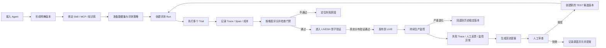

# Eval Loom 项目业务需求说明

> 本文根据 `frontend-pro` 当前原型整理，只描述产品业务，不约束数据库、接口、框架或后端实现方式。它回答的核心问题是：这个系统服务谁、管理什么、用户如何使用、各模块之间如何形成闭环。

## 0. 原型判读说明

本文只把当前正式导航中可进入的页面视为产品范围：

- 登录与工作区切换。
- 评测总览。
- Agent 管理与 Agent 详情。
- Skill 管理。
- MCP 管理。
- 知识库管理。
- 实验运行。
- 数据集。
- 评测策略。

`frontend-pro` 中仍保留了一些 Ant Design Pro 模板自带页面，例如账户中心、通用表单、通用列表、示例 Dashboard 和 Chatbot。这些页面没有进入当前正式路由，不属于本项目业务需求，编码时不应把它们误认为待实现模块。

当前原型同时使用了真实返回数据和前端演示兜底数据，因此页面中的具体数量、名称和指标只用于表达界面，不是业务常量。例如：

- 总览与 Agent 管理页展示的 Agent 数量不同。
- Agent 列表与 Agent 详情展示的 24 小时成功率不同。
- 评测策略总数与各生命周期分类下展示的数量可能不同。
- Skill、MCP、知识库在真实业务数据缺失时仍展示演示资产。

编码时应实现本文描述的业务含义和计算口径，不应复制这些演示数字，也不应依赖演示数据自动补齐真实结果。

## 1. 一句话定义

Eval Loom 是一个面向企业 Agent 的全生命周期质量治理平台。

它把 Agent、Skill、MCP 工具服务、知识库、评测数据集和评测策略统一放进一个工作区中管理，通过离线评测、影子流量验证、生产监控和 Trace 回流，帮助团队持续回答四个问题：

1. 当前有哪些 Agent 和能力资产，它们分别由谁负责、处于什么状态？
2. 某个具体版本的质量是否达到要求，能不能进入下一阶段？
3. Agent 的一次任务为什么成功或失败，问题发生在哪一步？
4. 生产中发现的问题怎样沉淀为改进版本，并安全发布或快速回退？

因此，本系统不是一个通用 Agent 编排器，也不负责帮助用户搭建 Agent 工作流；它负责的是 Agent 及其依赖能力的接入、观测、评测、发布把关和持续改进。

## 2. 产品要解决的问题

企业 Agent 通常不是一个孤立模型，而是由模型、提示词或 Skill、工具、知识库和运行配置共同组成。只看最终回答，很难判断失败到底来自模型、工具、知识检索还是业务规则。

本系统需要解决以下业务问题：

- Agent 来源分散：可能来自 GitHub、上传的代码包或已运行系统中的 SDK 埋点，缺少统一资产目录。
- 版本不可追溯：评测结果如果没有绑定明确版本，就无法复现，也无法公平比较。
- 质量标准分散：数据集、评估器、能力维度和发布门槛没有形成统一策略。
- 执行过程不可见：只知道成功或失败，不知道中间调用了哪个模型、工具和知识库。
- 生产问题不能闭环：线上失败样本没有自动进入回归资产，问题可能反复出现。
- 发布风险高：能力变更直接进入生产，没有离线验证、影子验证和质量门禁。
- 多团队协作困难：Agent、工具和知识由不同团队负责，缺少负责人、工作区和审查机制。

## 3. 目标用户与职责

### 3.1 Agent 开发者

负责接入和维护 Agent，查看运行质量与 Trace，定位失败原因，提交新版本并发起评测。

典型诉求：

- 把 GitHub 仓库、代码包或线上 Agent 接入平台。
- 查看 Agent 当前版本、运行状态、成功率、延迟、成本和调用量。
- 查看一次请求内部的完整执行步骤。
- 在发布前运行回归评测，确认新版本没有退化。

### 3.2 评测负责人或质量工程师

负责维护数据集、评测能力、评分维度、评估器、质量门禁和评测策略。

典型诉求：

- 定义“好 Agent”的判断标准。
- 将标准 Benchmark、历史缺陷和生产失败样本组织成数据集。
- 配置不同阶段应执行的评测以及通过条件。
- 分析 Trial 结果、维度得分和版本差异。

### 3.3 能力资产负责人

分别维护 Skill、MCP 和知识库。例如 Agent Platform 维护 Skill，Commerce Infra 维护订单 MCP，Knowledge Ops 维护政策知识库。

典型诉求：

- 管理资产配置和不可变版本。
- 查看资产被多少 Agent 使用。
- 查看新版本的评测证据。
- 审核来自 Agent、监控或人工的改进提案。
- 将版本从 TEST 推进到 LIVESH，再发布到 LIVE。

### 3.4 发布或运营负责人

负责根据评测证据决定是否晋级、发布或回退，关注生产质量与异常。

### 3.5 工作区管理员

负责成员、角色、工作区边界和接入凭证。原型当前只展示登录、工作区切换、角色和退出登录，完整成员与权限管理不在当前主流程中。

## 4. 产品业务边界

### 4.1 系统负责

- 统一登记和管理 Agent。
- 统一管理 Agent 依赖的 Skill、MCP 和知识库。
- 管理数据集、能力维度、评估器和评测策略。
- 创建并跟踪评测运行。
- 展示 Trial、Trace、Span、评分、成本和耗时。
- 用质量证据控制版本晋级和发布。
- 从生产问题、监控告警和人工反馈生成改进提案。
- 保留版本历史，支持生产回退和责任追溯。

### 4.2 系统不负责

- 不作为通用 Agent 工作流编排平台。
- 不替代 Agent 开发框架。
- 不负责在线客服、合同审查等具体业务本身。
- 不承诺自动修改生产资产；自动发现的问题先形成提案，必须经过审查和验证。
- 不把一次模型回答的好坏等同于整个 Agent 的质量。

## 5. 核心业务对象

### 5.1 工作区 Workspace

工作区是平台最上层的业务隔离单位。Agent、数据集、策略、运行记录、Trace、凭证和能力资产都属于当前工作区。

用户登录后只能看到自己有权限的工作区，并在页面顶部切换。切换工作区后，所有页面的数据上下文都应随之切换，不能混用其他工作区的数据。

### 5.2 Agent

Agent 是一个长期存在的被测业务系统身份，例如“Customer Support Agent”。它不是一次运行，也不等于某个代码包。

Agent 主要承载：

- 名称、用途和负责人。
- 接入来源。
- 当前运行健康状态。
- 各发布通道正在使用的版本。
- 绑定的评测策略。
- 生产与测试产生的 Trace、指标和成本。

### 5.3 Agent 版本

Agent 版本代表一个可复现的实现快照。同一个 Agent 可以同时存在多个版本，并分别位于 TEST、LIVESH 和 LIVE 通道。

所有评测结果都必须能回答“评的是哪个 Agent 的哪个版本”。“当前 Agent”不能替代明确版本。

### 5.4 Skill

Skill 是 Agent 可复用的任务能力定义，包含任务指令、输入输出约定、允许调用的工具、最长执行步骤、超时与降级边界。

示例“Refund Resolution”负责识别退款意图、查询订单与政策、说明退款结果，并把高风险请求转人工。

Skill 的质量关注任务完成度、工具使用正确率、规则遵循、步骤数、延迟等。

### 5.5 MCP Server

MCP Server 是 Agent 使用的工具服务资产，包含服务连接、传输方式、认证方式、工具清单和工具 Schema。

平台关心的不只是“能不能连通”，还包括：

- 工具定义是否兼容。
- 参数是否符合 Schema。
- 调用成功率和延迟。
- 认证与凭证是否健康。
- 某次版本变更是否会破坏现有 Agent。

### 5.6 知识库

知识库是可版本化的检索资产，包含知识来源、同步状态、索引配置、切分策略、Embedding、召回和重排配置。

平台需要衡量知识库的检索召回率、引用正确率、答案忠实度、内容冲突和无结果率，而不是只显示“索引已构建”。

### 5.7 数据集

数据集是可复用、可版本化的评测样本集合。原型表达了四类业务形态：

- 标准 Benchmark：稳定衡量通用或核心能力。
- 回归样本：记录历史缺陷，防止问题复发。
- 生产 Trace：从真实流量中筛选并沉淀案例。
- Agentic 任务：包含任务、可用工具、环境或期望状态的多步骤任务。

数据集不是简单文件。导入后还要经过结构校验、重复项处理、抽样复核和版本固化，达到可用状态后才能稳定用于评测。

### 5.8 能力、评分维度与评估器

这三个概念需要严格区分：

- 能力：业务上要衡量的大类，例如回答质量、工具使用、安全合规、知识检索。
- 评分维度：能力下可量化的具体观察项，例如答案相关性、工具正确率、忠实度、检索召回率。
- 评估器：计算评分的具体方法，例如确定性匹配、LLM Judge、策略合规检查、轨迹质量分析。

一个能力可以包含多个评分维度；一个维度可以由一个或多个评估器提供信号。维度还需要有权重和通过阈值。

### 5.9 评测策略

评测策略把以下内容编排成一套可执行的质量规则：

- 在哪个评测阶段使用。
- 由什么事件触发。
- 使用哪个版本的数据集。
- 使用哪些评估器和评分维度。
- 哪些指标是硬门禁以及各自阈值。
- 当前是否启用。
- 绑定了哪些 Agent 或能力资产。

评测策略回答的是“在什么时机，用什么样本和方法，按什么门槛判断质量”。

### 5.10 评测运行 Run

Run 是一次批量评测实验。它至少要明确：

- 运行名称。
- 被测 Agent 及其明确版本，或被测能力资产及其明确版本。
- 使用的数据集版本。
- 适用的评测策略。
- 并发任务数。
- 成本预算。

Run 的结果必须固化，后续可以用于版本比较、发布证明和失败样本回灌。

### 5.11 Trial

Trial 是 Run 中一个具体样本的一次执行。一个 Run 通常包含多个 Trial。

每个 Trial 都应有独立状态、得分、耗时、错误和 Trace。Run 的通过任务数、平均得分、成本和总耗时由全部 Trial 汇总而来。

### 5.12 Trace 与 Span

Trace 表示一次完整任务或请求的执行轨迹；Span 表示 Trace 中的一个步骤。

原型中的 Span 类型包括：

- Agent：Agent 自身的任务入口或子流程。
- LLM：模型规划、生成或判断。
- Tool：工具或 MCP 调用。
- Retriever：知识检索。

每个 Span 要能查看输入、输出、状态、耗时、属性和评分。Trace 需要汇总总耗时、Token、成本和 Span 数量，并支持树形视图与时间线视图。

### 5.13 评测证据 Evidence

评测证据是某个明确版本通过评测后形成的质量结果，例如任务完成度 94 分、工具正确率 97%、P95 延迟 1320ms。

每条证据都包含实际值、门槛、单位和是否通过。版本晋级不能只凭人工点击，必须有属于该版本且仍然有效的证据。

### 5.14 回流提案 Proposal

回流提案是对 Skill、MCP 或知识库提出的改进建议。来源可以是：

- Agent：执行过程中发现能力缺口后提出。
- Monitor：监控发现延迟、失败率或质量异常后提出。
- Human：业务或运营人员根据政策变化、人工复核提出。

提案包含变更主题、原因、关联 Trace、目标版本、风险等级和审查状态。提案本身不能直接修改 LIVE；被接受后才能形成或关联 TEST 候选版本。

## 6. 两套生命周期必须分开理解

### 6.1 版本部署通道：TEST / LIVESH / LIVE

这套通道适用于 Agent、Skill、MCP 和知识库的具体版本。

#### TEST

- 用于离线验证。
- 不接收生产用户流量。
- 使用固定数据集和发布门禁验证候选版本。
- 版本可能处于草稿、评测中、就绪或被阻断状态。

#### LIVESH

- 用于影子验证。
- 复制一定比例的真实生产流量给候选版本。
- 候选版本可以执行和产生指标，但输出不能返回给真实用户。
- 目的是比较候选版本与 LIVE 版本在真实分布下的质量、稳定性、延迟和成本。

#### LIVE

- 当前正式生产版本。
- 接收真实请求并向用户返回结果。
- 持续被监控，并支持快速回退到历史稳定版本。

一个资产可以同时在三个通道指向不同版本。例如 v2.6.0 在 TEST，v2.5.1 在 LIVESH，v2.4.3 在 LIVE。所谓 Agent 当前处于 LIVE，更准确地说是“该 Agent 已有正式生产版本”，并不代表 TEST 和 LIVESH 中没有其他候选版本。

### 6.2 评测使用阶段：开发验证 / 持续回归 / 发布门禁 / 生产监控

这套阶段用于分类评测策略，不是部署环境。

#### 开发验证

开发者在开发过程中手动触发，用于快速试验提示词、工具和执行逻辑。强调反馈速度，样本可少，门槛可相对灵活。

#### 持续回归

代码或能力变化后自动或定时触发，用于确保历史问题不复发。重点使用回归数据集。

#### 发布门禁

版本晋级前触发。任何硬门禁失败，都应阻断从 TEST 进入 LIVESH 或从 LIVESH 进入 LIVE。

#### 生产监控

面向真实流量持续或按异常触发。发现质量下降、延迟升高或规则违规后，生成告警、回流样本或改进提案。

## 7. 端到端业务闭环

### 7.1 接入 Agent

用户在 Agent 管理中选择一种接入方式：

#### GitHub 仓库

登记仓库、分支或 Tag、构建目录和入口文件。适合由平台获取源码并形成版本的 Agent。

#### 上传代码包

上传 ZIP、TAR.GZ 或 TGZ，选择运行时并填写入口命令。上传后应形成带校验值的不可变制品版本。

#### SDK 接入

适合已经部署在其他系统中的 Agent。用户选择工作区接入凭证和 SDK 类型，由 Agent 主动上报 Trace。原型支持 Python/DeepEval、TypeScript 和 OpenTelemetry 三种接入概念。

接入动作首先创建草稿。草稿表示资产信息已登记，但未必已经完成构建、验证、凭证配置或正式运行。

### 7.2 准备能力资产

Agent 可以依赖一个或多个 Skill、MCP 和知识库。每项资产都需要负责人、配置、版本和使用关系。

不同 Agent 可以复用同一能力资产，因此一次资产升级可能影响多个 Agent。资产详情中的“绑定 Agent 数”用于提示变更影响范围。

### 7.3 准备数据集

用户通过导入向导完成：

1. 选择 JSON、JSONL 或 CSV 文件，也可以先创建空数据集。
2. 填写名称、版本、资产类型和用途说明。
3. 进行结构预检，识别输入、期望输出和重复项。
4. 创建数据集草稿。
5. 后续处理重复项、无效样本和需人工复核的样本。
6. 固化为可用于评测的数据集版本。

用户可以查看样本预览、版本记录和 Schema，也可以导出数据集。

### 7.4 配置评测策略

用户选择评测阶段，创建或编辑策略：

1. 指定策略名称和适用阶段。
2. 指定触发方式：手动、发布后、定时或生产异常。
3. 选择数据集版本。
4. 组合确定性匹配、LLM Judge、策略合规和轨迹质量等评估器。
5. 设置任务成功率、安全违规率等门禁。
6. 启用策略并绑定 Agent 或能力资产。

策略可以停用。停用后不再被自动触发，也不应参与发布门禁判定，但历史执行结果必须保留。

### 7.5 创建和执行评测 Run

用户创建一次运行，选择被测对象、版本、数据集和策略，并设置并发与成本上限。

运行经历以下业务阶段：

1. 准备环境。
2. 执行任务。
3. 汇总评分。
4. 完成。

运行状态包括：

- 排队中：已创建，等待执行。
- 运行中：正在执行 Trial 或评分。
- 已暂停：用户请求暂停，等待恢复。
- 已完成：全部任务处理完毕，结果已固化。
- 失败：运行因环境、Agent、评估器或系统错误无法完成。
- 已停止：用户主动终止，保留已经产生的结果。

运行中或暂停时，用户可以暂停、恢复或停止；结束后的结果不再变化，用于版本比较和审计。

### 7.6 查看运行证据

运行列表用于快速比较运行状态、进度、得分和更新时间。选中一次运行后，需要看到：

- 被测 Agent 与版本。
- 数据集。
- 当前状态和执行阶段。
- 任务通过数与总数。
- 平均质量得分。
- 总成本和总耗时。
- 最近 Trace 事件。
- 每个 Trial 的状态、得分和耗时。
- 各评分维度的汇总结果。

这部分的业务目的不是只给出一个总分，而是提供足够证据判断“能否发布”和“为什么失败”。

### 7.7 查看 Agent 生产运行与 Trace

Agent 详情页是 Agent 日常观测工作台。用户可以按环境、状态、时间范围和关键词筛选 Trace。

选中 Trace 后：

- 左侧查看请求概况、状态、时间和耗时。
- 中间查看 Span 树或时间线。
- 右侧查看某个 Span 的输入输出、属性和评分。

页面顶部汇总 Agent 当前版本、负责人、24 小时成功率、P95 延迟、Trace 数量和预计成本。

用户应能从失败 Trace 判断问题属于：

- Agent 规划错误。
- 模型生成问题。
- 工具选择或参数错误。
- MCP 上游超时或失败。
- 知识检索质量不足。
- 业务策略或安全规则违规。

### 7.8 能力资产评测与晋级

Skill、MCP 和知识库共用一套治理流程，但评测内容不同。

用户在资产页选择通道和版本，运行相应评测。评测完成后展示证据与门槛。只有要求的证据全部通过，版本才允许晋级。

晋级路径固定为：

`TEST → LIVESH → LIVE`

不能从 TEST 直接跳到 LIVE，也不能让失败证据通过前端操作绕过门禁。

进入 LIVESH 后，系统复制一定比例的生产流量验证候选版本，但候选输出不影响真实用户。影子验证通过后才能发布到 LIVE。

### 7.9 问题回流与持续改进

生产 Trace、监控异常或人工业务变化都可以形成提案。

审查者需要看到提案原因、风险、关联 Trace 和建议版本，并作出接受或拒绝决定：

- 接受：创建或关联新的 TEST 候选版本，进入评测闭环。
- 拒绝：保留拒绝原因，提案关闭，不改变现有版本。

即使提案由 Agent 自动生成，也不能自动写入 LIVESH 或 LIVE。

### 7.10 生产回退

如果 LIVE 版本出现严重质量退化、稳定性问题或安全风险，负责人可以把 LIVE 通道指回已验证的历史稳定版本。

回退是通道指针变化，不是删除新版本。新版本、评测证据、事故原因和操作记录都要保留，后续仍可修复后重新进入验证流程。

## 8. 页面模块分别承担什么业务

### 8.1 评测总览

面向负责人提供当前工作区的质量全景：

- 正在运行的评测数量。
- Agent 总数。
- 已完成评测数量与平均分。
- Skill、MCP、知识库的资产数量、LIVE 健康数和待审提案数。
- 最近评测运行。
- 关键能力维度当前得分与阈值。

它是发现问题和进入具体管理页面的入口，不承担详细配置。

### 8.2 Agent 管理

提供 Agent 资产台账和接入凭证管理。

Agent 资产列表支持按名称、负责人、来源、生命周期和运行状态筛选，展示三通道版本、24 小时 Trace 量、成功率、P95 延迟、负责人和凭证健康状态。

批量操作表达的业务能力包括批量绑定策略、变更负责人和导出。

### 8.3 Agent 详情

提供单个 Agent 的运行观测、Trace 分析、指标、版本和设置入口。

当前原型完整表达的是 Traces 和 Metrics；Threads、Versions、Settings 仍是预留模块。

### 8.4 Skill 管理

管理 Skill 目录、指令、输入输出约定、允许工具、步骤与超时边界、绑定 Agent、版本通道、评测证据和回流提案。

### 8.5 MCP 管理

管理 MCP 服务连接、传输和认证、工具注册表、Schema 兼容、调用成功率、延迟、凭证健康、版本通道、评测证据和回流提案。

### 8.6 知识库管理

管理知识来源、同步状态、索引与检索配置、重建索引、检索调试、版本通道、评测证据和回流提案。

### 8.7 实验运行

创建和观察批量评测，支持运行控制、进度跟踪、Trial 结果、Trace 事件、维度评分、成本与耗时分析。

### 8.8 数据集

管理 Benchmark、回归样本、生产 Trace 和 Agentic 任务，支持导入、结构校验、样本复核、版本记录、Schema 查看和导出。

### 8.9 评测策略

围绕开发验证、持续回归、发布门禁和生产监控四个阶段，编排数据集、评估器、评分维度和质量门禁，并管理策略启停和 Agent 绑定。

## 9. 关键业务规则

以下规则是当前原型所表达的产品底线：

1. 所有业务资产都属于一个工作区，工作区之间必须隔离。
2. Agent、Skill、MCP、知识库和数据集都需要版本化。
3. 已用于评测或发布的版本不可被原地覆盖；修改应形成新版本。
4. 任何评测结果都必须关联明确的被测版本、数据集版本和评测规则。
5. Run 包含多个 Trial；Run 汇总不能代替 Trial 级证据。
6. Trace 必须能拆到 Span，以支持定位模型、工具和检索问题。
7. 结束的 Run 结果需要固化，不能因后续配置变化而被重新解释或覆盖。
8. 停止 Run 时保留已经完成的 Trial、Trace、得分和成本。
9. 质量门禁是硬约束，门禁未通过时不能晋级。
10. 版本只能按 TEST、LIVESH、LIVE 顺序晋级。
11. LIVESH 只做影子执行，不能把候选输出返回给真实用户。
12. LIVE 回退指向历史稳定版本，不删除问题版本和证据。
13. 自动生成的改进只能先形成提案，不能直接修改生产版本。
14. 提案接受后只产生 TEST 候选版本，仍需重新评测。
15. 接入凭证按工作区隔离，可绑定多个 Agent；密钥原文只在创建时展示一次。
16. 凭证需要支持可用、即将过期和已吊销等状态，并支持轮换。
17. 资产负责人和绑定关系用于判断变更责任及影响范围。
18. 生产质量不能只看成功率，还要同时关注能力得分、延迟、成本和安全信号。

## 10. 三类 Trace 数据的区别

原型中 Trace 出现在多个地方，业务上不能混为一谈。

### 10.1 生产调用 Trace

来自 LIVE 或 LIVESH 的真实或影子请求，主要在 Agent 详情中查看。用于日常观测、事故定位和生产回流。

### 10.2 评测 Trial Trace

由某次 Run 中的某个数据集样本产生，必须关联 Run、Trial、Agent 版本和数据集样本。用于解释评分和发布判断。

### 10.3 回流证据 Trace

这是被选中并附加到提案或回归样本的 Trace 引用。它不是复制出来的一套新执行记录，而是用于说明“为什么要改”的证据。

同一个生产 Trace 可以被选入数据集形成新的回归样本，也可以被提案引用，但两者的业务用途不同。

## 11. 三类状态的区别

原型同时展示多种状态，不能共用一个“status”概念解释全部业务。

### 11.1 Agent 运行状态

- 草稿：接入信息尚未完成验证或发布。
- 正常：当前可运行版本健康。
- 异常：构建、部署、凭证或运行健康存在问题。

### 11.2 版本状态

- draft：配置中的候选版本。
- evaluating：正在生成评测证据。
- ready：要求的证据已通过，可申请晋级。
- active：当前通道正在使用。
- blocked：证据或策略未通过，禁止晋级。
- retired：不再使用，但历史保留。

### 11.3 评测运行状态

- queued、running、paused、completed、failed、cancelled。

状态之间有关联，但不等价。例如 Agent 可以处于正常状态，同时一个新版本评测失败；LIVE 版本仍然可以继续服务。

## 12. 当前原型中需要统一的业务口径

这些不是技术问题，而是编码前必须统一的产品定义。

### 12.1 “Agent 生命周期”命名不够准确

Agent 列表用单个 TEST、LIVESH 或 LIVE 表示 Agent 生命周期，但同一 Agent 实际可以在三个通道同时存在不同版本。

建议业务口径改为“最高已发布通道”或“当前生产阶段”，真正的状态以三通道版本为准。

### 12.2 评测策略与 Run 的关系在创建页缺失

策略页明确表达了数据集、评估器和门禁的组合，但“新建运行”原型只让用户选择 Agent、版本和数据集，没有选择或展示评测策略。

业务上必须明确：

- Run 是直接选择一套评测策略；或
- Run 由 Agent 已绑定策略自动推导；或
- 用户临时组合数据集与评估器，形成一次性策略快照。

从整套原型的方向看，推荐口径是：正常运行选择已有策略；开发验证允许临时配置，但创建时仍固化成策略快照。

### 12.3 数据集分类混合了不同维度

Benchmark、回归和 Trace 描述的是来源或用途，Agentic 描述的是任务结构。一个 Agentic 数据集也可能同时是 Benchmark 或回归集。

业务上更合理的口径是：

- 数据来源或用途：benchmark、regression、production trace。
- 任务形态：single-turn、multi-turn、agentic。

两者可以组合，不应强制互斥。

### 12.4 能力维度页面展示的是“当前得分”，但缺少得分范围

一个维度的得分必须有统计范围，例如某个 Run、某个 Agent 版本、最近 24 小时或当前工作区基线。没有范围的全局分数无法用于业务判断。

### 12.5 Skill、MCP、知识库的配置与版本绑定关系必须明确

资产页切换版本通道时，配置区也应展示对应版本的配置。不能出现选择 TEST v2.6.0，却仍展示 LIVE v2.4.3 配置的情况。

### 12.6 资产评测与 Agent 整体评测需要区分

- Agent 整体评测关注完整任务完成质量。
- Skill 评测关注特定任务能力和行为边界。
- MCP 评测关注工具契约、可靠性和性能。
- 知识库评测关注检索与内容质量。

它们可以共享 Run/Trial/Trace 的展示模式，但被测对象、数据集和评分维度不同。

### 12.7 “成功率”必须定义成功口径

原型同时存在调用成功率、任务成功率、工具成功率和门禁成功率。文案和统计必须明确是哪一种，不能只写“成功率”。

### 12.8 LIVESH 的流量比例含义要统一

LIVESH 的 10% 或 15% 指复制多少生产请求进入影子版本，不表示从 LIVE 切走相同比例，也不表示候选结果会返回给用户。

### 12.9 提案审查后的业务动作尚未在原型展开

审查至少需要支持查看关联 Trace、风险、差异、接受或拒绝、审查意见。接受后应明确创建候选版本，拒绝后应记录原因。

### 12.10 版本比较是核心价值，但当前入口不完整

页面文案多次提到“对比版本质量”，但当前原型主要展示单次 Run 和单个通道。后续产品应能选择两个或多个明确版本，在同一数据集和策略口径下比较得分、失败样本、延迟和成本。

## 13. 建议的首期业务范围

为了让首期形成真正可用的闭环，建议按以下范围理解，而不是试图一次完成所有预留页面。

### 13.1 首期必须闭环

- 登录并进入有权限的工作区。
- 通过一种或多种方式接入 Agent，并形成明确版本。
- 创建或导入数据集，完成样本查看与版本固化。
- 创建评测策略，配置数据集、评估器和门禁，并绑定 Agent。
- 创建 Run，执行多个 Trial。
- 查看运行状态、进度、Trace、评分、成本和失败原因。
- 从失败 Trial 或生产 Trace 生成回归样本。
- 对一个候选版本执行发布门禁判断。
- 保留完整历史结果。

### 13.2 可以作为后续增强

- Threads 会话聚合。
- 完整 Agent Settings。
- 多版本横向对比和趋势报告。
- 自动定时评测与生产异常触发。
- Skill、MCP、知识库的完整在线编辑器。
- LIVESH 真实流量复制和基线对照。
- 自动提案生成、提案审查和一键创建候选版本。
- 生产回退操作台。
- 完整组织、成员、权限和审计后台。

## 14. 首期业务验收标准

当以下场景可以完整走通，才算这个系统的核心业务成立：

1. 用户登录并进入一个工作区。
2. 用户接入一个客服 Agent，平台中出现 Agent 草稿和明确版本。
3. 用户导入一个退款场景数据集，完成结构校验并发布可用版本。
4. 用户创建一套回归或发布门禁策略，选择评估器并设置成功率与安全门槛。
5. 用户将策略绑定到 Agent，创建针对明确 Agent 版本的 Run。
6. Run 执行至少三个 Trial，并经历准备环境、执行任务、汇总评分和完成阶段。
7. 用户可以看到每个 Trial 的结果以及 Agent、LLM、Tool、Retriever Span。
8. 用户可以看到输入输出、耗时、Token、成本、属性和维度得分。
9. 某个失败 Trial 能明确定位到具体工具调用或策略违规。
10. 用户能把该失败案例沉淀为回归样本，形成新的数据集版本。
11. 再次评测新 Agent 版本时，系统能够验证历史问题是否已经修复。
12. 发布门禁未通过时版本不能晋级；通过后才能从 TEST 进入 LIVESH。
13. 所有历史 Run、Trial、Trace 和评分在刷新页面或后续配置变化后仍保持原结果。

## 15. 最终业务理解

Eval Loom 的核心不是“管理几个列表”，而是建立一条可审计的 Agent 质量生产线：

`资产有版本 → 版本能评测 → 评测有过程证据 → 证据控制发布 → 生产问题可以回流 → 回流形成下一版改进`

Agent 是最终被治理的业务系统；Skill、MCP 和知识库是影响 Agent 行为的可复用能力资产；数据集提供问题样本；评估器产生质量信号；评测策略把这些信号变成判断规则；Run 和 Trial 承载一次实际验证；Trace 和 Span解释执行过程；TEST、LIVESH、LIVE 控制版本如何安全进入生产；提案和回退机制保证系统可以持续改进且不会失控。

如果编码实现偏离了这条闭环，只完成了 CRUD、静态仪表盘或单次跑分，就还没有实现这个产品真正要做的事情。

## 16. 编码前应确认的业务决策

以下问题已经从原型中暴露出来，但原型本身还没有给出唯一答案。它们属于产品决策，不应由编码人员自行猜测。

### 16.1 首期被测对象范围

需要确认首期 Run 是否只评测 Agent，还是同时允许直接评测 Skill、MCP 和知识库版本。

从原型整体方向看，四类对象最终都需要评测；但首期可以先让 Agent Run 完整闭环，能力资产评测复用同一运行体系逐步接入。

### 16.2 Run 如何获得评测策略

需要在以下口径中选择一个：

- 用户创建 Run 时明确选择已有策略。
- 系统根据 Agent 和当前阶段自动选择已绑定策略。
- 用户临时配置评估内容，系统为本次 Run 固化一次性策略快照。

建议同时支持前两种：手动实验由用户选择，自动回归和发布门禁从绑定关系推导；无论来源如何，Run 创建后都固化当时的策略内容。

### 16.3 门禁作用于什么动作

需要明确哪些动作必须受门禁控制。原型已经明确版本晋级受门禁控制，但还应确认：

- Agent 版本从 TEST 进入 LIVESH。
- Agent 版本从 LIVESH 进入 LIVE。
- Skill、MCP、知识库版本晋级。
- Agent 引用某个新的能力资产版本。
- 已经处于 LIVE 的版本在指标持续退化时是否自动降级或只告警。

建议首期由门禁阻断晋级，不自动回退生产；生产回退由有权限的负责人确认执行。

### 16.4 生产 Trace 如何进入数据集

需要明确生产 Trace 被选为回归样本后是否允许脱敏、裁剪和补充期望结果。生产 Trace 通常只有真实输入输出，不天然具备标准答案，因此必须经过复核才能成为稳定回归样本。

建议流程是：选择 Trace → 脱敏 → 转为数据集草稿样本 → 人工补充或确认期望结果 → 发布新数据集版本。

### 16.5 谁能审查提案和发布版本

原型展示了角色和负责人，但没有展开权限。业务上至少要区分：

- 谁可以提交提案。
- 谁可以接受或拒绝提案。
- 谁可以配置门禁。
- 谁可以把版本推进到 LIVESH。
- 谁可以发布 LIVE 或执行回退。

首期即使不做复杂权限后台，也要确定这些动作是普通成员、资产负责人、评测负责人还是工作区 Owner 才能执行。

### 16.6 版本比较的统一口径

版本比较必须使用相同数据集版本、相同评测策略和相同评分口径。否则分数变化无法证明来自被测版本本身。

需要确认比较结果是否以 LIVE 为默认基线，以及哪些变化可以判定为退化：总分下降、硬门禁失败、关键样本失败、延迟或成本超限都可能构成退化。

### 16.7 LLM Judge 的可信度要求

模型评分具有波动性。业务上要决定发布门禁能否完全依赖 LLM Judge，还是必须同时包含确定性规则或多次采样结果。

对于安全、权限、资金、合规等高风险维度，建议必须有确定性或规则型门禁，不能只依赖模型主观评分。

### 16.8 失败与未通过的区别

需要统一以下口径：

- 执行失败：任务没有正常完成，例如环境错误、模型超时、工具不可用。
- 质量未通过：任务完成了，但得分或规则不达标。
- 运行失败：Run 因系统性原因无法继续。
- 门禁阻断：Run 可能正常完成，但结果不允许版本晋级。

这四种情况在用户处理方式和统计口径上不同，不能都显示为“失败”。

## 17. 业务优先级与实施顺序

### P0：建立可用的评测闭环

- 工作区隔离。
- Agent 接入与明确版本。
- 数据集导入、复核和版本化。
- 评测策略创建与 Agent 绑定。
- Run 与 Trial 执行。
- Trace 与 Span 查看。
- 维度评分、成本和耗时汇总。
- Run 暂停、恢复、停止和结果固化。
- 失败样本进入回归数据集。

缺少其中任何一项，都无法完整证明“发现问题—定位问题—验证修复”的闭环。

### P1：建立发布质量控制

- Agent 三通道版本管理。
- 发布门禁。
- TEST 到 LIVESH 的晋级。
- LIVESH 影子指标与 LIVE 基线比较。
- LIVESH 到 LIVE 的发布。
- 历史稳定版本回退。
- 完整操作记录。

### P2：扩展到能力资产治理

- Skill 版本、配置、评测与提案。
- MCP 连接、工具契约、版本评测与凭证健康。
- 知识来源、索引版本、检索评测与同步健康。
- 能力资产与 Agent 的绑定和影响范围分析。

### P3：自动化持续改进

- 定时回归。
- 发布事件自动触发评测。
- 生产异常自动触发评测。
- 从低分 Trace 自动生成候选提案。
- 自动推荐回归样本。
- 趋势、版本比较和质量报告。

## 18. 编码时不能把产品做成什么

为了防止对原型的表面化实现，以下结果都不算完成本项目：

- 只实现 Agent、数据集、策略等若干独立列表，但对象之间没有绑定关系。
- 只展示最终总分，不能追溯到 Trial、Trace 和具体 Span。
- Run 使用“Agent 当前版本”，导致历史结果无法复现。
- 数据集被修改后，历史 Run 的样本内容随之改变。
- 评测策略被修改后，历史 Run 的门禁结果随之改变。
- 所有 Trace 混在一起，无法区分生产调用和评测任务。
- TEST、LIVESH、LIVE 只是标签，没有不同的流量与发布含义。
- 评测未通过仍可直接发布。
- 自动提案可以绕过人工审查修改 LIVE。
- 停止 Run 后丢失已完成任务的结果。
- 页面依赖 Mock 数据补全真实业务对象，导致数字看似完整但不可追溯。

这个产品的最低合格标准不是“页面能展示”，而是每一项质量结论都能追溯到明确版本、明确样本、明确策略和真实执行证据。
